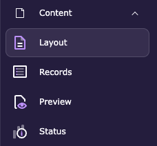

# Create a page with the context menu

<!-- #TYPO3v14 #Beginner #Backend #Editing @dhubert974 -->

Dragging a page icon into the page tree is quick, but it asks you to be accurate with the mouse: drop a few pixels too high and your new page becomes a sibling instead of a child. The context menu takes the opposite approach. You right-click the page you want to start from, TYPO3 asks you where the new page should go, and you pick the position from a list — no aiming required. It is the safer route when the tree is crowded, or when the difference between "under this page" and "next to it" matters.

## Learning objective

In this step-by-step guide you will create a new page in the TYPO3 backend using the page tree context menu, choose exactly where it sits in the tree, and give it a title.

## Prerequisites

### Tools and technology

* Backend access to a TYPO3 v14 installation
* A backend user with permission to create pages
* A page tree with at least one page in it

### Knowledge and skills

* You know how to [Log in to the TYPO3 backend](LogInToTheTypo3Backend.md)
* [Basic knowledge of the TYPO3 backend](https://docs.typo3.org/permalink/t3start:backend)

## Open the page tree

1. In the module menu, choose **Content** > **Layout**.

   

2. In the page tree, find the page you want to create the new page under or next to.

## Open the context menu

1. Right-click the page in the page tree.

   The context menu opens. Alongside **Show**, **Edit** and **Info**, it offers two ways to create a page.

2. Choose **More options…** and then **'Create New' wizard**.

   

> [!TIP]
> The same context menu has a **New subpage** entry. It skips the position step and puts the new page directly underneath the page you clicked. Use it when you already know the new page belongs there; use the wizard when you want to choose the position yourself.

## Choose where the page goes

TYPO3 shows the **New record** screen with the branch of the tree you are working in.

1. Read the tree fragment under **Select a position for the new page**. Each arrow marks a slot the new page can occupy: above a page, below it, or nested underneath it.
2. Click the arrow at the position you want.

   

## Fill in the page and save

The **Create new Page** form opens on its **General** tab.

1. Leave **Type** set to **Standard** for an ordinary page.
2. Enter the **Page title**. This field is required — TYPO3 marks it in red until you fill it in.
3. Optionally fill in the other fields on the tab:
   * **URL Segment** — the part of the address after your domain. TYPO3 derives it from the title if you leave it empty.
   * **Alternative Navigation Title** — a shorter title to show in menus.
   * **Subtitle**

   

4. Click **Save**, then **Close**.

The new page appears in the page tree at the position you chose.

> [!NOTE]
> A new page is hidden from visitors until you enable it. See [Enabling and disabling a page in the page tree](EnablingAndDisablingAPageInThePageTree.md).

## Summary

Congratulations! You created a page from the page tree context menu: you opened the 'Create New' wizard on an existing page, picked the exact position for the new page from the list of slots, and filled in its title. Where drag and drop asks for a steady hand, this route asks a question and lets you answer it — which is what you want when the tree is deep or the placement matters.

## Next steps

Now that you can create a page this way, you might like to:

* [Create a page with drag and drop](CreateAPageWithDragAndDrop.md), the faster route when placement is obvious
* [Enabling and disabling a page in the page tree](EnablingAndDisablingAPageInThePageTree.md) to make your new page visible
* [Add content elements](AddContentElements.md) to fill the page
* [Modifying the page properties](ModifyingThePageProperties.md)

## Resources

* [Creating pages in the TYPO3 Editors Tutorial](https://docs.typo3.org/permalink/t3editors:pages-creating)
* [Page properties in the TYPO3 Editors Tutorial](https://docs.typo3.org/permalink/t3editors:pages-properties)
