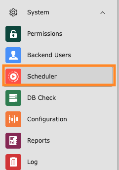
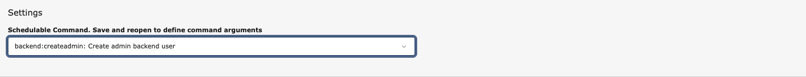
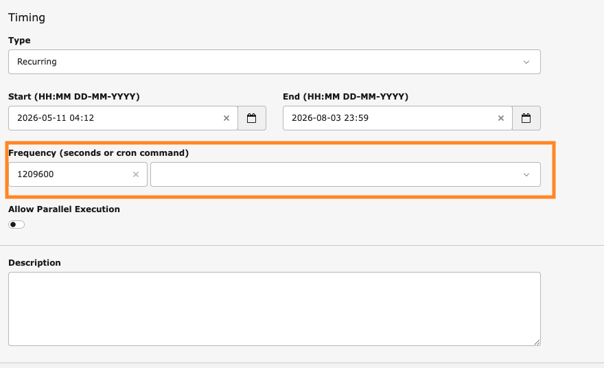

# Create a Scheduler task

<!-- #TYPO3v14 #Intermediary #Backend #Configuration #Server @delfynn2kx -->

Some work should not wait for someone to click a button. Caches need clearing overnight, exports need sending every fortnight, indexes need rebuilding while nobody is looking. The **Scheduler** is where you describe that work once — what should run, and how often — and then leave it alone.

A Scheduler task is two decisions in one form: *what* it does, which comes from the task types your installation provides, and *when* it does it, expressed either as an interval in seconds or as a cron expression.

## Learning objective

In this step-by-step guide you will create a recurring Scheduler task in the TYPO3 backend: choose the task type, configure what it runs, set how often it repeats, and check it in the task list.

## Prerequisites

### Tools and technology

* Backend access to a TYPO3 v14 installation with an administrator account
* The **scheduler** system extension installed and active
* A server-side cron job that calls the TYPO3 scheduler

### Knowledge and skills

* You know how to [Log in to the TYPO3 backend](LogInToTheTypo3Backend.md)
* [Basic knowledge of the TYPO3 backend](https://docs.typo3.org/permalink/t3start:backend)
* Basic familiarity with cron expressions is useful, but not required

> [!IMPORTANT]
> Creating a task in the backend does not make it run. TYPO3 only executes due tasks when the scheduler itself is invoked, which is normally a cron job on the server calling the `scheduler:run` command. Without that cron job your task will sit in the list with a **Next Execution** date that never arrives.

## Open the Scheduler module

1. In the module menu, choose **System** > **Scheduler**.

   

The module lists the tasks that already exist, grouped by task group.

## Create a new task

1. Click **+ New task**.

   

The **New task** form opens.

## Choose what the task runs

The **General** section decides which kind of work the task performs.

1. Leave **Disable** switched off so the task is active once you save it.
2. Open the **Task** dropdown and choose a task type.

   

   The dropdown groups the available types by the extension that provides them. The **scheduler** group holds the core tasks — garbage collection, file indexing, table optimisation — while other groups appear only if the matching extension is installed.

   

3. Optionally pick a **Task group** to file the task under, or create one with the **+** button. Groups only affect how the list is organised.

The **Settings** section underneath changes to match the task type you picked. A garbage collection task asks which cache backends to clean; a different type asks for something else entirely.

## Configure the task: running a console command

**Execute console commands** is worth a closer look, because it is the task type that lets you schedule anything TYPO3 exposes on the command line.

1. Choose **Execute console commands** as the task type.
2. Open the **Schedulable Command** dropdown and pick the command you want to run.

   

   The list holds every command registered by the core and by your installed extensions, each with a short description.

   

> [!NOTE]
> Read the field label: **Save and reopen to define command arguments**. The arguments belonging to a command do not appear until the task has been saved once. If a command needs arguments, expect to save, reopen, and fill them in on a second pass.

## Set when the task runs

The **Timing** section decides how often the task repeats.

1. Set **Type** to **Recurring** for a task that repeats. (**Single** runs the task once at the start date.)
2. Enter a **Start** date and time. This is the earliest the task may run.
3. Optionally enter an **End** date, after which the task stops repeating.
4. Fill in **Frequency**, in one of two ways:

   * **A cron expression**, if you want the task pinned to particular times. `0 2 * * *` runs it every day at 02:00.

     

   * **An interval in seconds**, if you only care how much time passes between runs. `1209600` is fourteen days.

     

5. Leave **Allow Parallel Execution** switched off unless the task is safe to run twice at once. With it off, a run that is still going will not be started again.
6. Optionally add a **Description** so colleagues can tell what the task is for.
7. Click **Save**.

## Complete the command arguments

If your task runs a console command that takes arguments, reopen it now. The **Settings** section has grown a field for each argument, with the command's own description underneath.

1. Fill in the arguments the command needs. Required ones are flagged if you leave them empty.
2. Click **Save**, then **Close**.

## Check the task in the list

Back in the Scheduler module, the task appears in its group.

Read the row to confirm the task is set up as you intended:

* **Type** and **Frequency** repeat what you entered in the Timing section.
* **Last Execution** and **Next Execution** tell you whether the scheduler is actually running. If **Next Execution** is in the past and **Last Execution** stays empty, the cron job on the server is not calling TYPO3.

The icons at the end of the row let you edit, disable and delete the task, and trigger a run without waiting for the schedule.

## Summary

Congratulations! You created a recurring Scheduler task: you picked what it runs from the task types your installation provides, configured its settings — including a console command and its arguments — set how often it repeats using either a cron expression or an interval in seconds, and confirmed it in the task list. Work that used to need somebody to remember it now happens on its own.

## Next steps

Now that you can schedule work, you might like to:

* [Clearing the frontend cache in the TYPO3 backend](ClearingFrontendCacheInTypo3Backend.md), the manual counterpart to the cache garbage collection tasks
* Set up the server cron job that calls the scheduler
* Review the task groups on your installation and tidy existing tasks into them

## Resources

* [The Scheduler system extension documentation](https://docs.typo3.org/c/typo3/cms-scheduler/main/en-us/)
* [Introduction to the TYPO3 backend](https://docs.typo3.org/permalink/t3start:backend)
