# Create backend user groups in TYPO3

<!-- #TYPO3v14 #Beginner #Backend #Configuration #Editing @dhubert974 -->

Backend user groups in TYPO3 help administrators manage permissions and access rights for editors and backend users. Instead of assigning permissions individually to each user, groups allow you to define reusable access rules.

## Learning objective

In this step-by-step guide, you will learn how to create backend user groups and configure permissions for backend users in TYPO3.

## Prerequisites

### Tools and technology

* Access to a TYPO3 v14 backend
* Administrator privileges or permission to manage backend users and groups

### Knowledge and skills

* Basic familiarity with navigating the TYPO3 backend
* Understanding of TYPO3 users and permissions

## Explore the Users module

Backend user groups define shared permissions that can be assigned to multiple backend users.

1. Open the **Administration > Users** module.

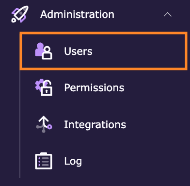

You will be redirected to the **Users** page, which lists all backend users of the site.

In the **doc header** section:

1. You'll find a drop-down menu with submodules
2. An option to create a new backend user
3. An option to create a new administrator

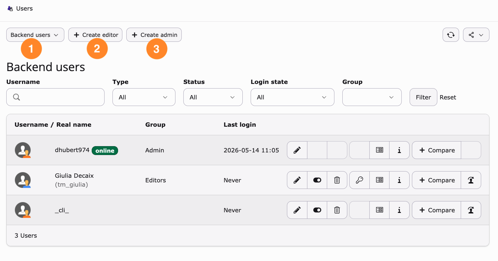

You will also find a search section with filters:

4. A field for searching for a user by their username
5. Filter by **type**: All, Admin or normal user
6. Filter by **status**: All, Enable or Disabled
7. Filter by **login state**: All, Logged in before, Never logged in, Currently logged in
8. Filter by **group**: All the groups you will create

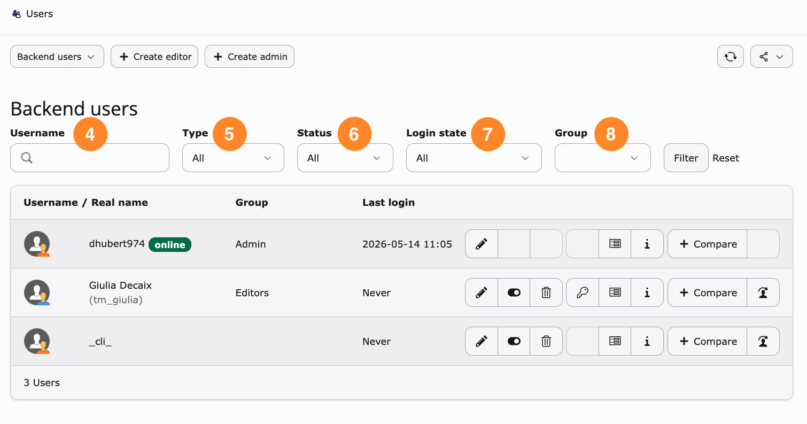

Finally, you'll see every user in the backend, with options:

9. Username and an indicator showing whether a user is online
10. Edit a user profile, enable or disable a user, or delete a user
11. Reset password (key icon), view user details, and access additional information such as the creation date, last modification date, creator, general summary, and assigned backend user groups.

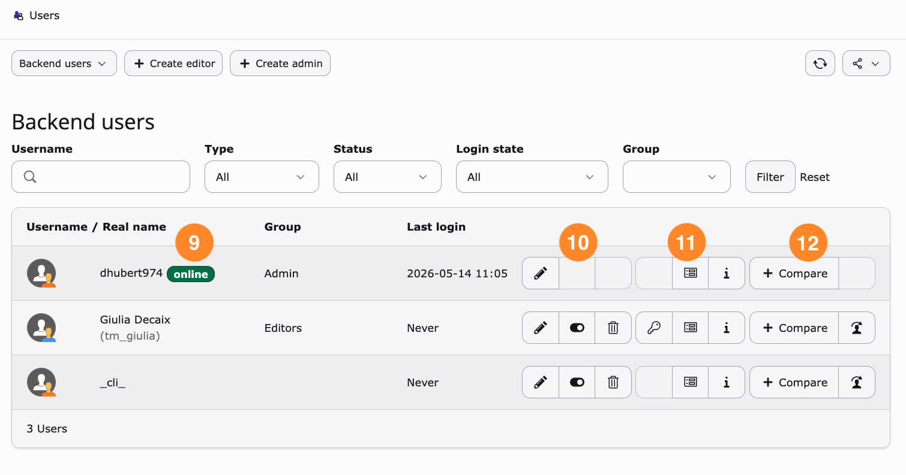

## Create backend user groups

Now, we will create new backend user groups.

1. Select sub-module: **Backend user groups**

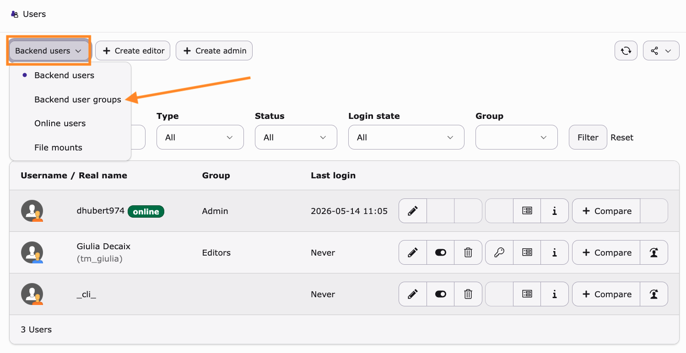

The Users page features similar elements: a group search filter, an edit button, options to enable, disable, or delete a group, and a details/information and compare button.

2. In the **doc header**, click **Create new backend user group**.

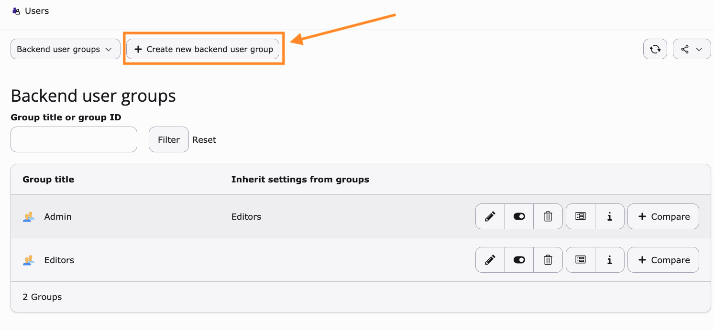

There are seven tabs available. In this guide, we will focus on the following tabs: **General**, **Record Permissions**, **Module Permissions**, and **Mounts**. The remaining tabs are:

* **Options**: Add group-specific TSConfig settings
* **Access**: Enable or disable the group
* **Notes**: Add notes about the group

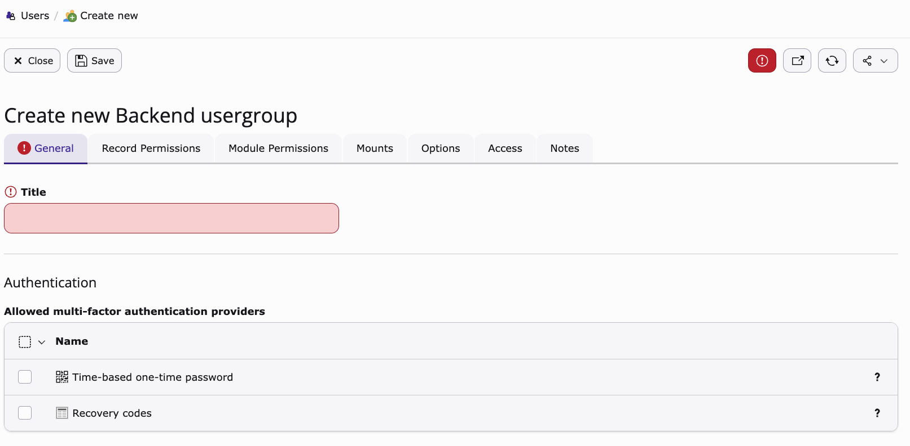

### General tab

1. You must name the group (required field).
2. This group will inherit permissions from the parent group.
3. You have two options for multi-factor authentication.

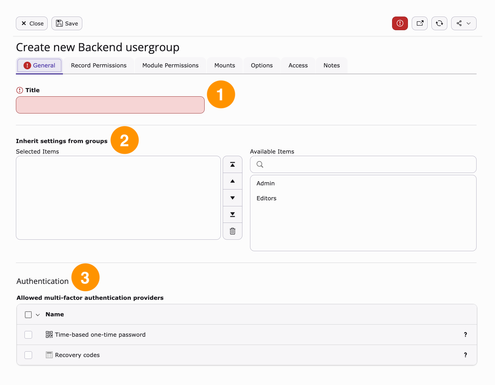

### Record permissions tab

#### Table permissions

This section allows you to set general backend permissions, such as **no access**, **read**, or **read and write** for various items.

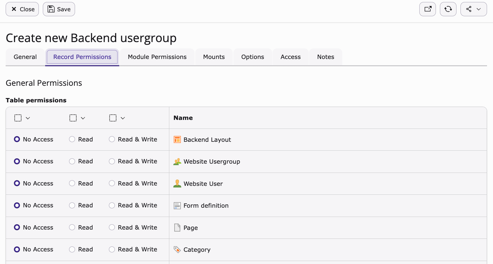

#### Allowed fields

This section allows you to grant access to specific fields for items enabled in the **Table permissions** section.

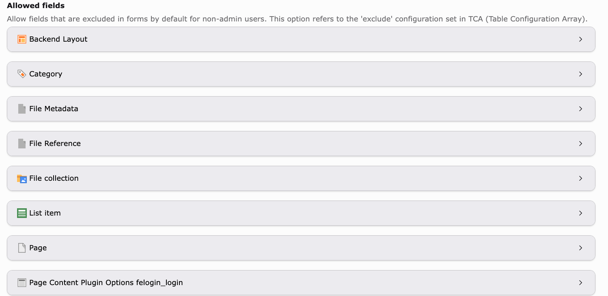

#### Specific permissions

**Allowed page types:** Allows you to grant access to specific page types depending on the group's role.

Example:

The **Publisher** group may only have access to standard pages, shortcuts, and links, while a more advanced **Editor** group may also access folders and menu separators.

**Explicitly allow field values:** Allows access to specific content element types. For example, some groups may not require access to **HTML content elements**.

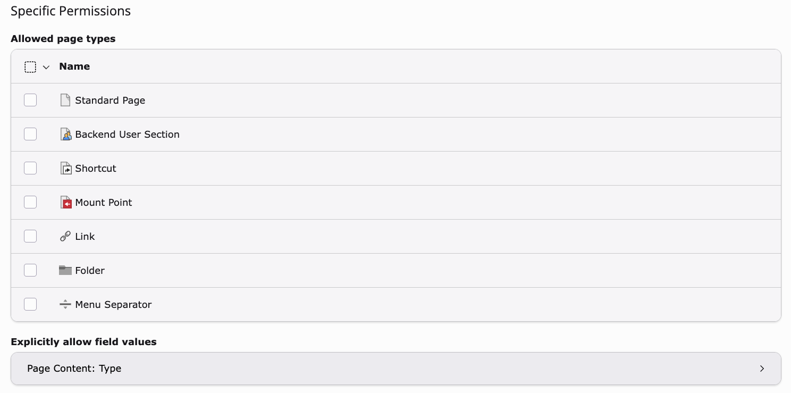

#### Language permissions

If your website is available in multiple languages, you can grant a group access to specific languages.

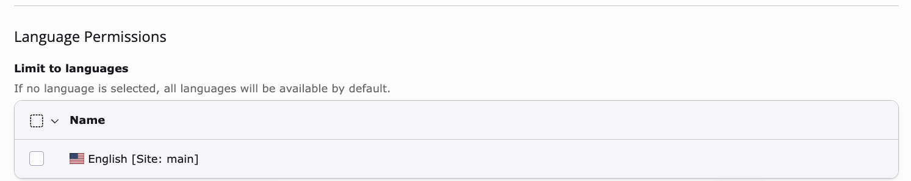

### Module permissions tab

This section grants access to TYPO3 backend modules, such as **Content > Layout**, **Content > Records**, or the **Media** module.

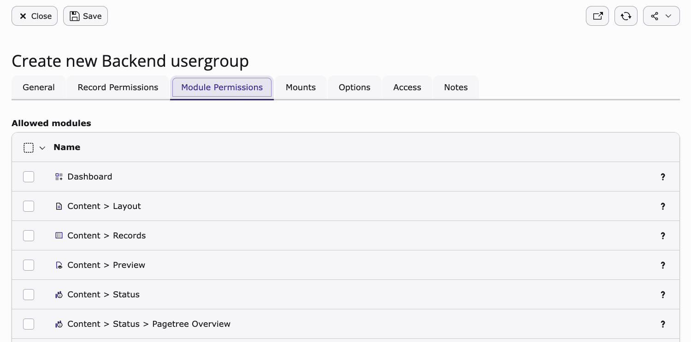

The rest of this section provides access to widgets such as RSS feeds, TYPO3 news, bookmarks, and more.

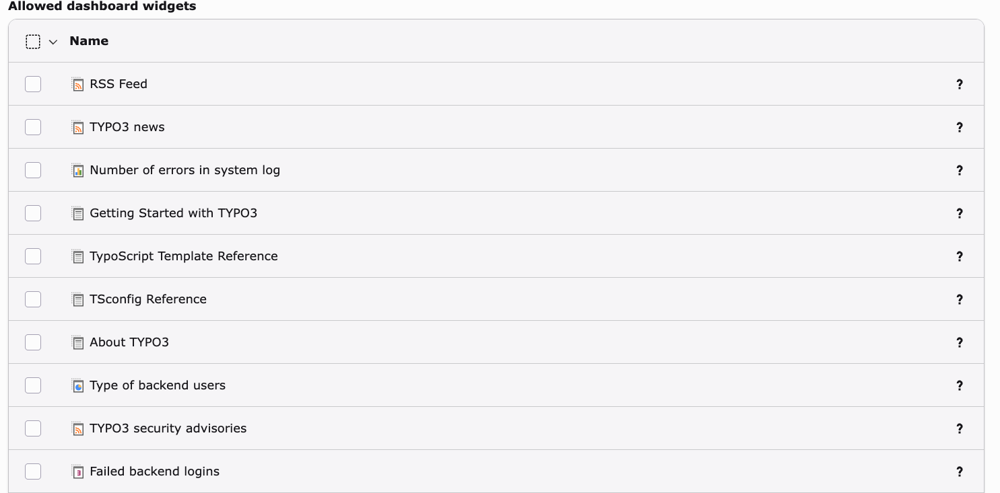

### Mounts tab

#### Page tree entry points

You can choose which pages the group will have access to in the page tree.

Example:

The **Publisher HR (Human Resources)** group might have access only to the **Careers** section to manage job postings and recruitment content, while the **Publisher Communications** group could have access to the **News** and **Events** pages to publish announcements and updates.

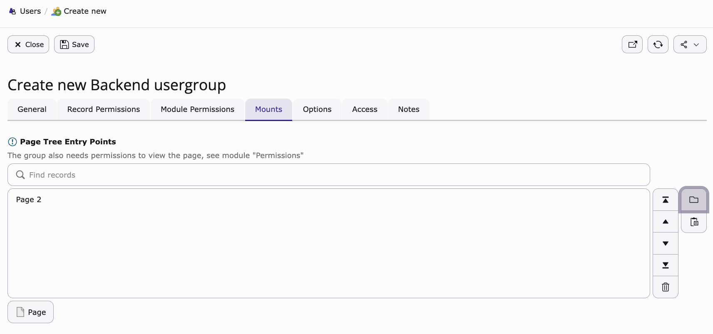

#### Fileoperation permissions

You can grant access to specific folders in the **Media module**. This allows users to upload, edit, and manage files only in designated locations.

Example:

The **Publisher HR** group may only have access to the **/media/hr/** folder for recruitment documents and employee-related images, while the **Publisher Communications** group could manage files in **/media/news/** and **/media/events/** for announcements and promotional content.

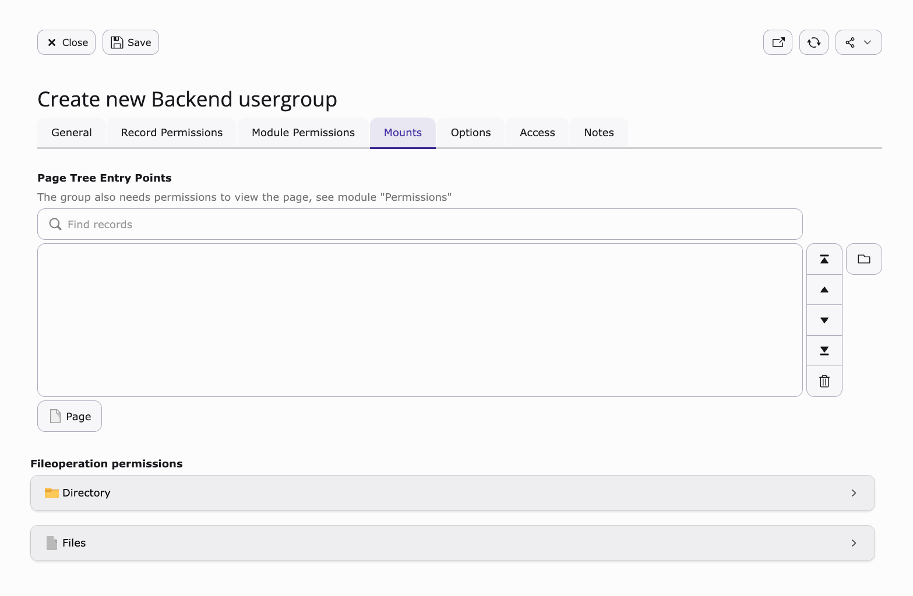

## Summary

Congratulations! You now know how to create backend user groups in TYPO3 and assign permissions to backend users.

## Next steps

Now that you have created backend user groups, you might like to:

* Create backend users

## Resources

* [TYPO3 backend user management documentation](https://docs.typo3.org/m/typo3/reference-coreapi/main/en-us/Administration/UserManagement/Index.html)
* [TYPO3 permissions documentation](https://docs.typo3.org/m/typo3/reference-coreapi/main/en-us/ApiOverview/Fal/Administration/Permissions.html)
