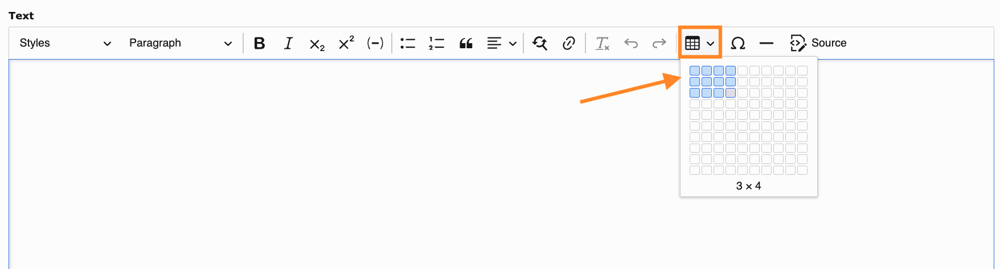
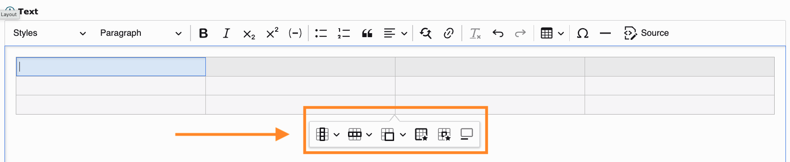
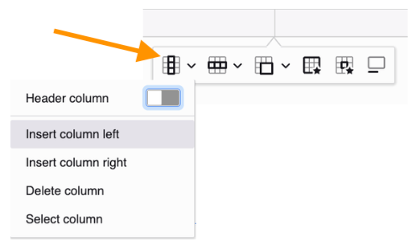
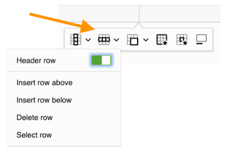
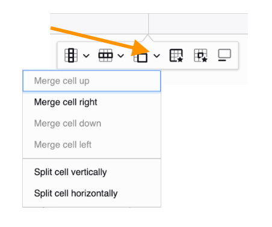
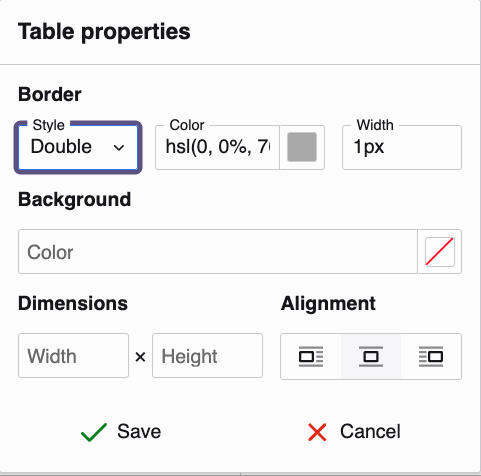
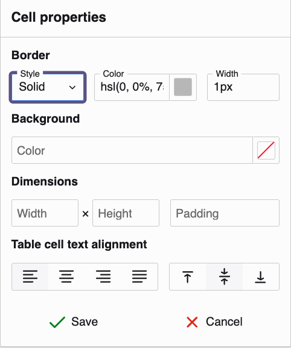
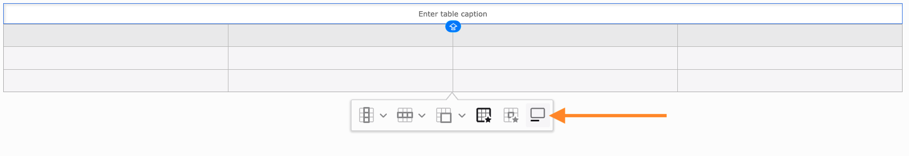

# Create tables in the Rich Text Editor

<!-- #TYPO3v14 #Beginner #ContentElements #Backend #Editing @delfynn2kx -->

Some information only makes sense side by side: opening hours, price lists, a comparison of two options. Written as running text it becomes hard to follow; arranged in rows and columns it can be read at a glance. The Rich Text Editor (RTE) lets you build such a table directly inside a text content element and adjust it afterwards — add a column, merge two cells, give the table a caption — without leaving the editor.

## Learning objective

In this step-by-step guide you will create a table in the Rich Text Editor and shape it to fit your content: adding and removing rows and columns, merging and splitting cells, adjusting table and cell properties, and adding a caption.

## Prerequisites

### Tools and technology

* A running TYPO3 v14 instance
* Backend access with an editor or administrator account
* A page containing a **Text** content element

### Knowledge and skills

* You know how to [Add content elements](AddContentElements.md)
* You are familiar with [the Rich Text Editor interface](https://docs.typo3.org/m/typo3/guide-step-by-step/main/en-us/10GettingStarted/30ContentCreation/30WorkWithTheRichTextEditor/Index.html)
* You have permission to edit content on the page (see [Page permissions](https://docs.typo3.org/m/typo3/tutorial-getting-started/master/en-us/UserManagement/PagePermissions/Index.html))

## Insert a table

1. Open the page in the TYPO3 backend.
2. Create a new **Text** content element, or open an existing one for editing.
3. Place the cursor where the table should go.
4. Click the **Insert table** icon in the Rich Text Editor toolbar.
5. Move the pointer across the grid to choose the number of rows and columns. The size you are about to insert is shown below the grid.
6. Click to insert the table.

   

The table appears in your content. Whenever the cursor sits inside it, a small toolbar appears below the table. This is where all the table tools live.

## Add or remove rows and columns

Use the table toolbar to change the structure of an existing table.

**To modify columns:**

1. Click inside the table.
2. Click the **Column** icon in the table toolbar.
3. Choose one of the options:
   * **Header column** — a toggle that turns the first column into a header
   * **Insert column left**
   * **Insert column right**
   * **Delete column**
   * **Select column**

   

**To modify rows:**

1. Click inside the table.
2. Click the **Row** icon in the table toolbar.
3. Choose one of the options:
   * **Header row** — a toggle, switched on by default
   * **Insert row above**
   * **Insert row below**
   * **Delete row**
   * **Select row**

   

The table updates immediately.

## Merge and split cells

Merging turns several cells into one — useful for a heading that spans the whole width of a table. Splitting does the opposite.

You can merge in two ways.

**Merge a selection:**

1. Select two or more adjacent cells.
2. Click the **Merge cells** icon in the table toolbar.

**Merge in one direction, or split:**

1. Click inside the cell you want to merge or split.
2. Click the arrow next to the **Merge cells** icon.
3. Choose one of the options:
   * **Merge cell up**
   * **Merge cell right**
   * **Merge cell down**
   * **Merge cell left**
   * **Split cell vertically**
   * **Split cell horizontally**

   

> [!NOTE]
> Directions that have no neighbouring cell are greyed out. In the screenshot the cursor sits in a corner cell, so only **Merge cell right** can be used.

## Modify table and cell properties

Beyond the structure, you can style the table itself and each cell individually.

**To modify the table:**

1. Click inside the table.
2. Click the **Table properties** icon.
3. Adjust the settings:
   * **Border** — style, colour and width
   * **Background** colour
   * **Dimensions** — width and height
   * **Alignment** — left, centre or right
4. Click **Save**, or **Cancel** to discard the changes.

   

**To modify a single cell:**

1. Click inside the cell.
2. Click the **Cell properties** icon.
3. Adjust the settings:
   * **Border** — style, colour and width
   * **Background** colour
   * **Dimensions** — width, height and padding
   * **Table cell text alignment** — horizontally left, centre, right or justified, and vertically top, middle or bottom
4. Click **Save**, or **Cancel** to discard the changes.

   

## Add a table caption

A caption describes what the table shows. It also helps people using a screen reader understand the table before they read it.

1. Click inside the table.
2. Click the **Toggle caption** icon in the table toolbar.
3. Type the caption text in the field that appears above the table.

   

Click the icon again to remove the caption.

## Delete a table

The table toolbar has no single "delete table" command. Remove the table by emptying it:

1. Click inside the table.
2. Open the **Row** or **Column** menu.
3. Choose **Delete row** or **Delete column**.
4. Repeat until the last row or column is gone.

The table disappears from the content element.

## Summary

Congratulations! You can now build a table in the Rich Text Editor and shape it around your content: adding and removing rows and columns, merging and splitting cells, styling the table and its cells, and giving it a caption. Information that was hard to follow as running text can now be read at a glance.

## Next steps

Now that you can create tables in the Rich Text Editor, you might like to:

* Format text inside the Rich Text Editor
* Create links inside content
* Insert images into text content

## Resources

* [Working with content elements in the TYPO3 Editors Tutorial](https://docs.typo3.org/permalink/t3editors:content-working)
* [Introduction to the TYPO3 backend](https://docs.typo3.org/permalink/t3start:backend)
