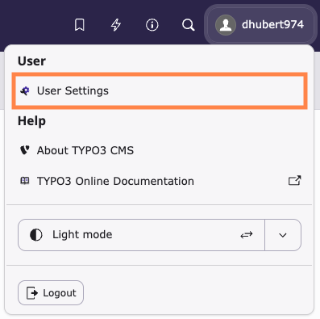
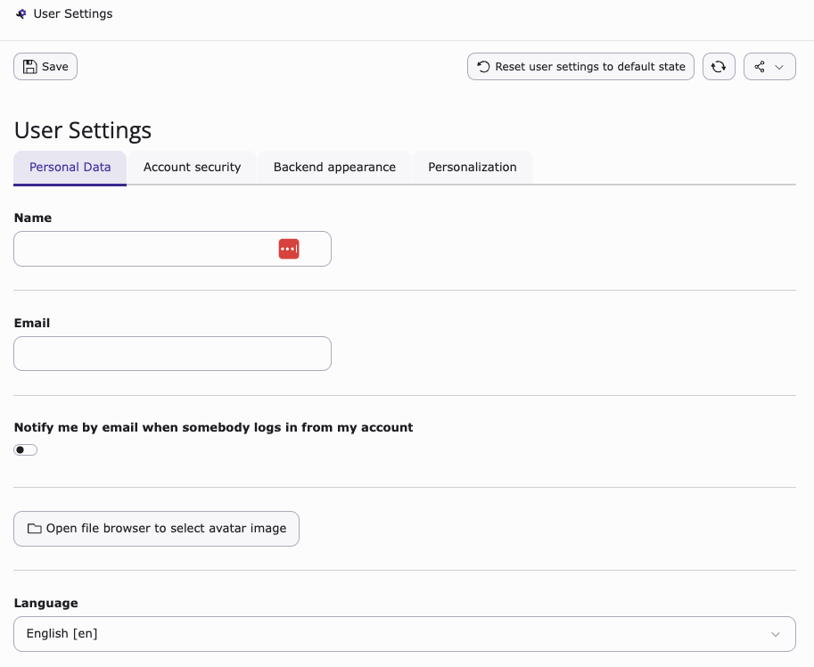
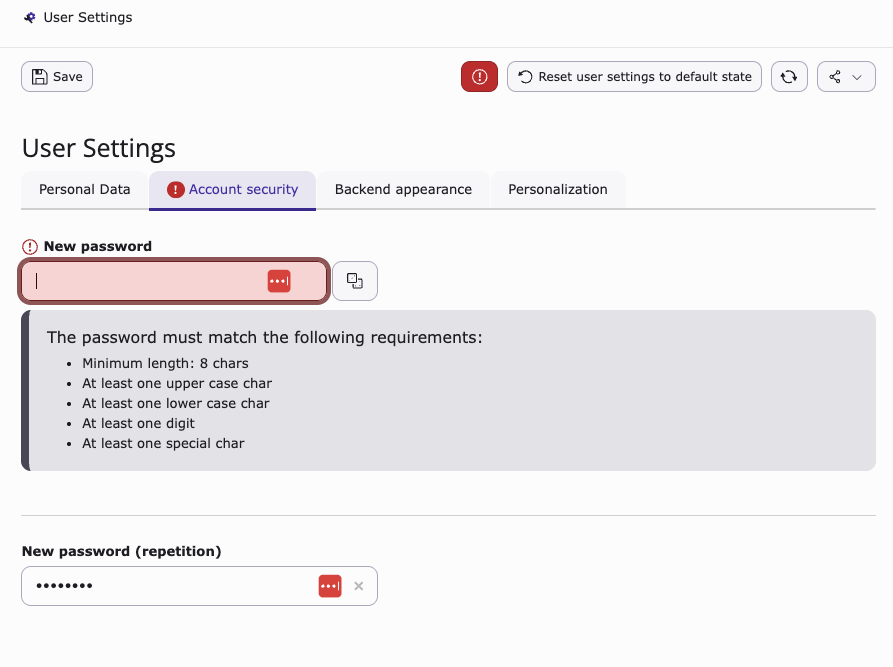
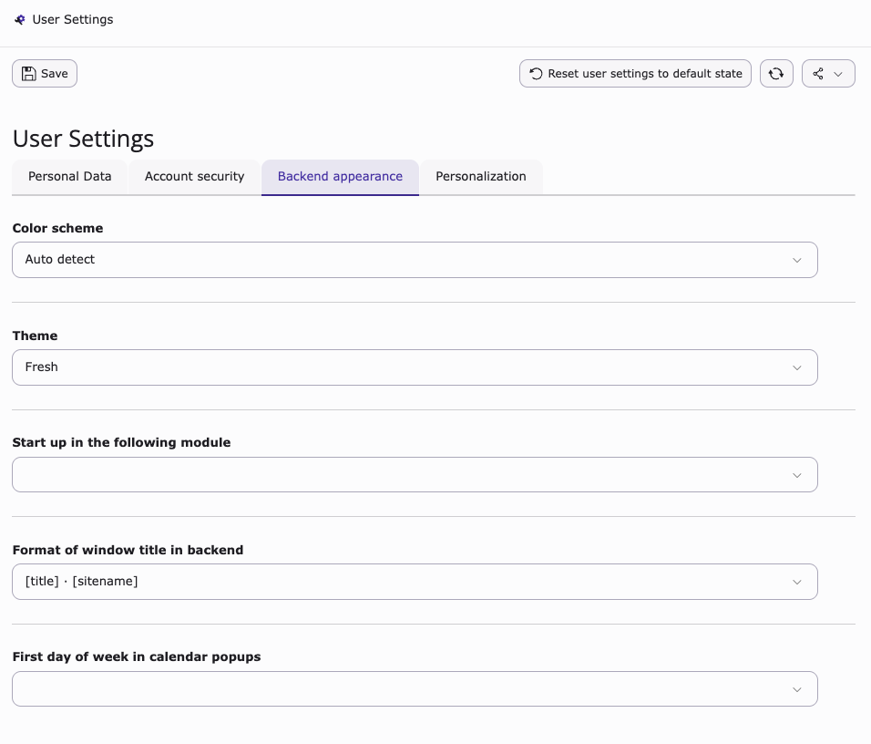
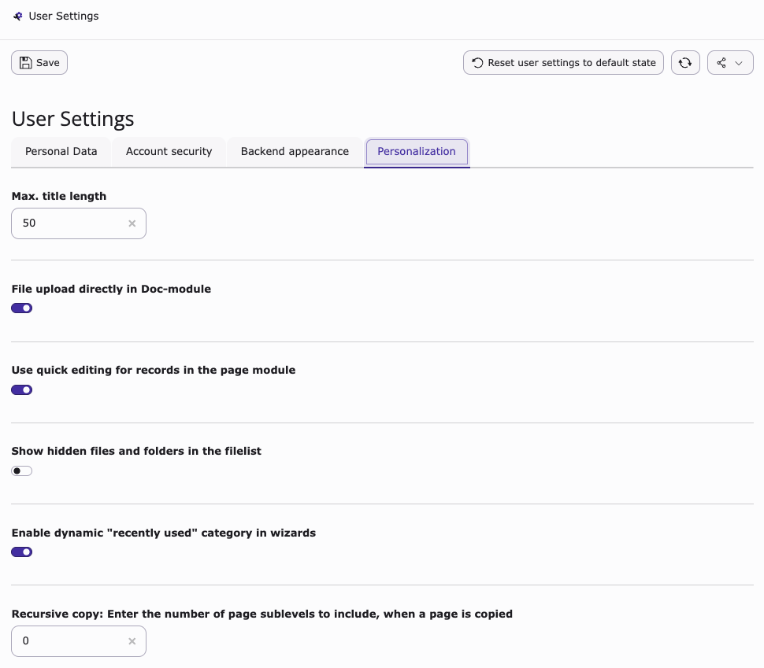

# Customize your user settings in the TYPO3 backend

<!-- #TYPO3v14 #Beginner #Backend #Editing @dhubert974 -->

The TYPO3 backend allows each user to customize their personal settings to improve their daily workflow.

User settings enable you to adjust preferences such as language, password, interface behavior, and notifications. Customizing your user settings helps you create a more efficient and personalized backend experience.

These settings only affect your personal backend experience and do not impact other users.

## Learning objective

In this step-by-step guide you will learn how to access and customize your user settings in the TYPO3 backend.

## Prerequisites

### Tools and technology

* Access to a TYPO3 backend (version 14)
* A user account with backend access

### Knowledge and skills

* Basic understanding of the TYPO3 backend interface

## Open your user settings

Your user settings are accessible from the administrative toolbar.

1. Log in to the TYPO3 backend.
2. Locate the administrative toolbar at the top of the screen.
3. Click your **username or avatar**.
4. Select **User settings** from the dropdown menu.

## Customize your personal preferences

You can customize various settings to suit your workflow.

1. Personal Data
   1. Change your name
   2. Change your email
   3. Activate "**Notify me by email when somebody logs in from my account**"
   4. Choose an avatar image from your browser
   5. Change the interface language (this affects your personal backend experience only, not the languages of your website).

   

2. Account security
   1. Change your password: when you are about to change your password, TYPO3 displays the requirements for your new password.
   2. You must enter the new password a second time to confirm it.

   

3. Backend appearance

   This tab lets you customize the appearance of your backend. You can configure:

   * **Color scheme**: Choose between Auto Detect, Light, or Dark mode.
   * **Theme**: Select a backend theme such as Fresh, Modern, or Classic.
   * **Start module**: Define which module is displayed when you log in to the backend.
   * **Window title format**: Choose how the backend title is displayed (for example: `[title] - [sitename]`).
   * **First day of the week**: Set which day is displayed as the first day in calendar popups. This setting affects how dates are displayed when selecting dates in the backend.

   

4. Personalization

   This tab lets you customize advanced behavior and editing options in the backend. You can configure:

   * **Max. title length**: Define the maximum number of characters displayed for record titles in the backend.
   * **File upload directly in Doc-module**: Allow files to be uploaded directly within the document module.
   * **Use quick editing for records in the page module**: Enable faster editing of content elements directly from the page module.
   * **Show hidden files and folders in the filelist**: Display hidden files and folders in the Media module.
   * **Enable dynamic "recently used" category in wizards**: Show recently used items for quicker access when creating new elements.
   * **Recursive copy**: Define how many subpages are included when copying a page and its content.

   

## Save your changes

Make sure your changes are applied.

1. Click the **Save** button.
2. Wait for the confirmation message.

## Summary

You have learned how to access and customize your user settings in the TYPO3 backend.

Congratulations! You now know how to personalize your backend experience to better suit your needs.

## Next steps

Now that you have customized your user settings, you might like to:

* Explore the TYPO3 backend interface
* Use the administrative toolbar for quick actions
* Manage bookmarks in the TYPO3 backend
