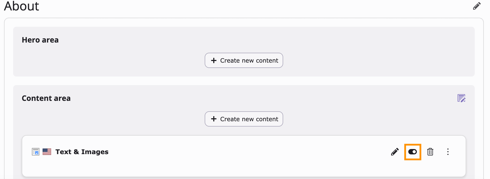
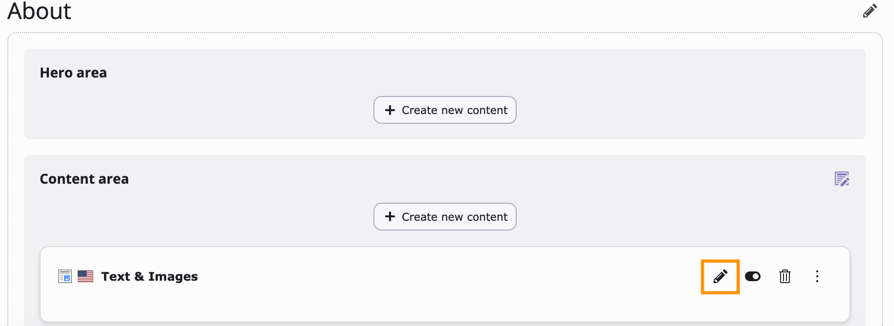
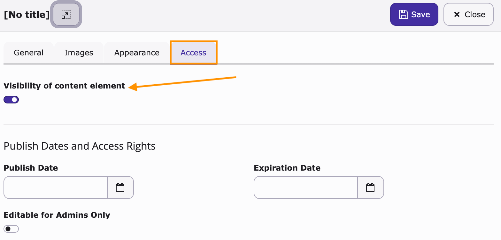
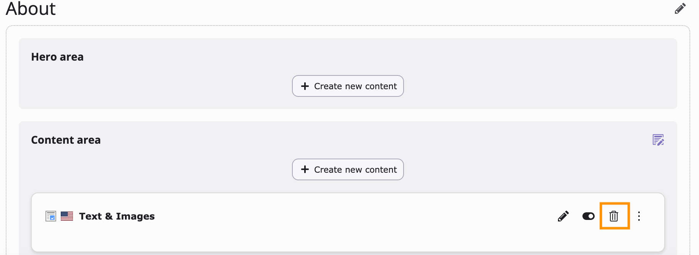
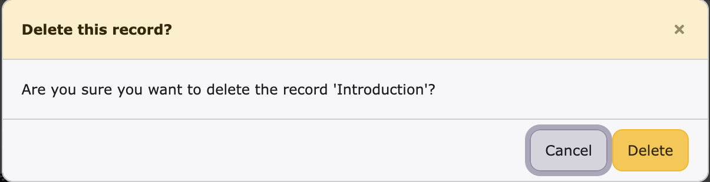
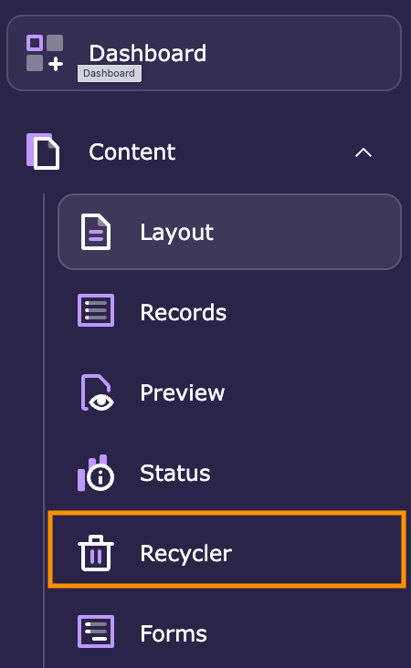
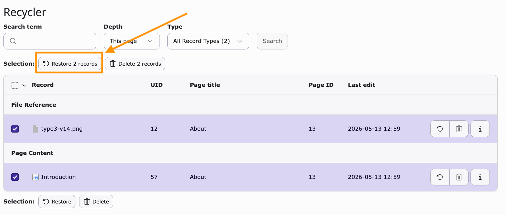
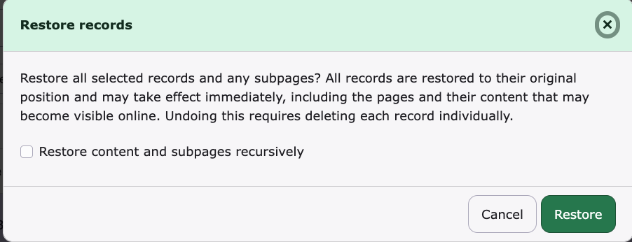

# Delete, hide and restore content elements

<!-- #TYPO3v14 #Beginner #ContentElements #Backend #Editing @dhubert974 -->

In TYPO3, you can manage content elements by deleting them, hiding them from the frontend, or restoring previously removed items. These actions help you control what is visible on your website without losing content unnecessarily.

## Learning objective

In this step-by-step guide you will learn how to:

* Hide a content element from the frontend
* Delete a content element
* Restore deleted content elements with the Recycler module

## Prerequisites

### Tools and technology

* TYPO3 v14 backend access
* A page containing content elements

### Knowledge and skills

* Basic understanding of TYPO3 backend navigation
* Familiarity with content elements

## Hide a content element

Hiding a content element removes it from the frontend while keeping it available in the backend.

1. Navigate to the **Layout module** in the TYPO3 backend.

### Method 1: Hide using the quick toggle

Use this method to quickly hide content directly from the page view.

1. Locate the content element you want to hide.
2. Click the **Hidden** toggle on the content element.

### Method 2: Hide through content element settings

Use this method when editing additional visibility or access settings.

1. Locate the content element you want to hide.
2. Click the **Edit (pencil icon)**.

3. Open the **Access** tab.
4. Under **Visibility of content element**, enable the **Hidden** toggle.
5. Click **Save** and **Close**.

The content element will no longer be visible on the frontend but remains available in the backend.

## Delete a content element

Deleting a content element removes it from the page.

1. On the **Layout module**, locate the content element you want to delete.
2. Click the **Delete (trash icon)**.

3. Confirm the deletion if prompted.

The content element will be moved to the Recycler.

## Restore a deleted content element

1. Open the page where the content element was located before it was deleted.
2. Navigate to the **Recycler module** in the TYPO3 backend.

3. Select all elements belonging to the content element. When a content element contains text and a media file, you must restore all its elements so that the entire content element is restored.
4. Choose **Restore xx records**.

5. In the confirmation message that appears, click **Restore**.

The content element will reappear on the page in its previous position.

## Summary

You have learned how to hide, delete, and restore content elements in TYPO3. These actions help you manage content safely without immediately losing important data.

Congratulations! You now understand how to control the visibility and lifecycle of content elements.

## Next steps

Now that you can manage content elements, you might like to:

* Create a content element in TYPO3
* Move content elements on a page
* Schedule content element publication
