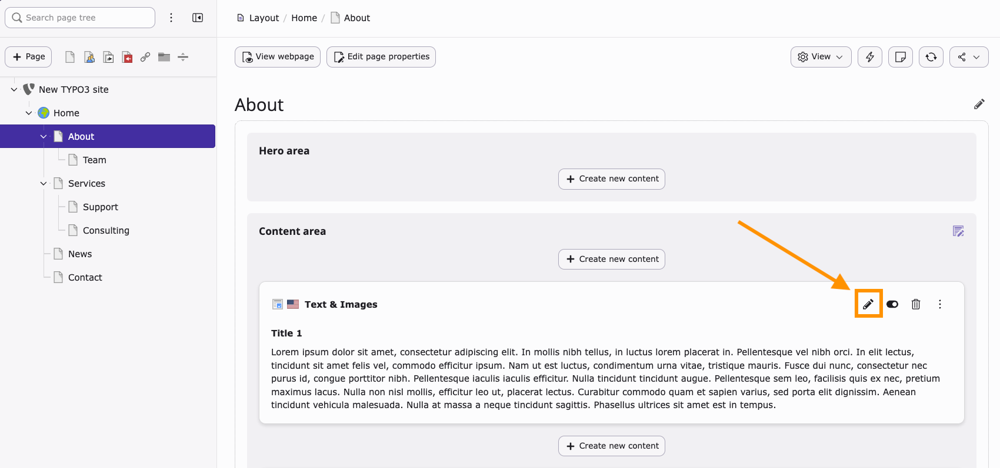
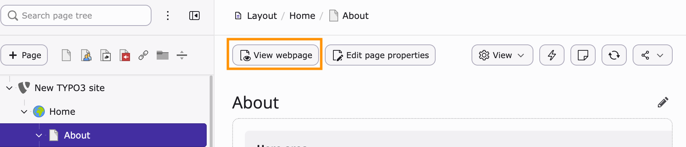

# Edit a content element

<!-- #TYPO3v14 #Beginner #ContentElements #Backend #Editing @dhubert974 -->

Editing content elements in TYPO3 allows you to update the visible content of your website without touching templates or code. Content elements are the building blocks of every page in TYPO3, such as text blocks, images, buttons, and more complex components like accordions or cards.

## Learning objective

In this step-by-step guide you will learn how to:

* Locate an existing content element in the TYPO3 backend
* Edit its content
* Save and preview your changes on the frontend

## Prerequisites

### Tools and technology

* TYPO3 v14 backend access
* A working TYPO3 installation
* A site with at least one page containing content elements

### Knowledge and skills

* Basic understanding of the TYPO3 page tree
* Basic backend navigation skills

## Edit a content element

1. Navigate to the **Layout module** in the TYPO3 backend.
2. In the page tree on the left, click the page that contains the content element you want to edit.
3. Click the **Edit (pencil icon)** on the content element.

4. Update the content fields (for example: text, images, headers).
5. Click **Save** and **Save and close**.

## Preview your changes

1. Click the **View webpage** button in the **document header**.

2. Check that your changes appear correctly on the frontend.
3. If needed, return to the backend and adjust the content element again.

## Summary

You have successfully edited a content element in TYPO3. This allows you to update website content quickly without modifying templates or code.

Congratulations! You now know how to edit existing content directly in the TYPO3 backend.

## Next steps

Now that you can edit content elements, you might like to:

* Add content elements to a page
* Move or reorder content elements on a page
* Delete and restore content elements

## Resources

* TYPO3 Backend Guide: Page Module
* TYPO3 Content Elements Overview
* TYPO3 v14 Documentation
