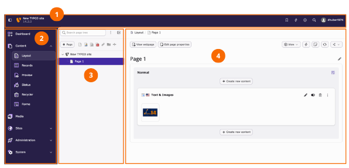
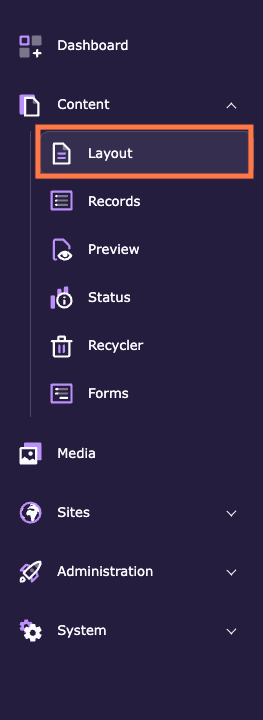
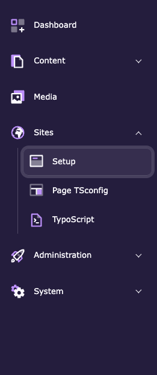
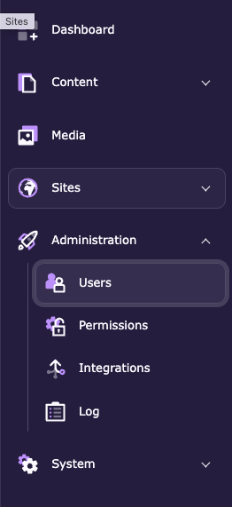
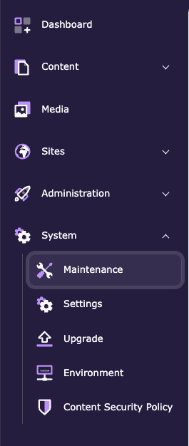
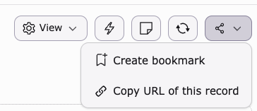
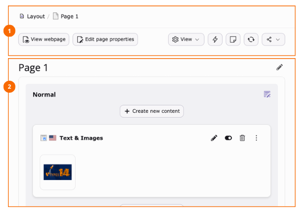
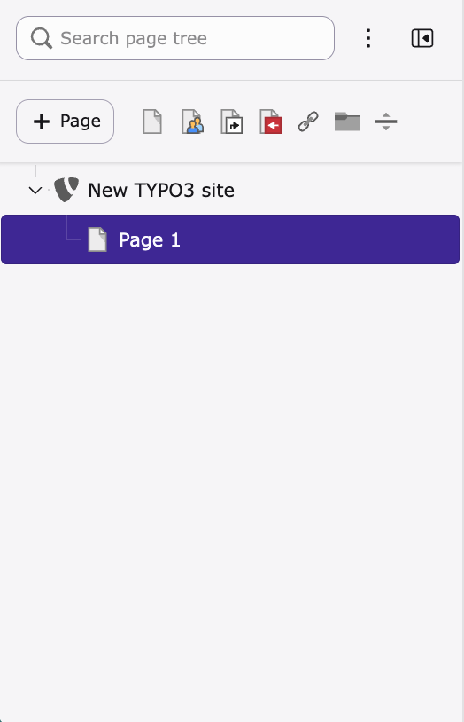

# Explore the TYPO3 backend interface

<!-- #TYPO3v14 #Beginner #Backend #Editing @dhubert974 -->

The TYPO3 backend interface is designed to help you manage content, media, and configuration in a structured way.

Understanding the main areas of the backend helps you navigate more efficiently and perform your daily tasks with confidence.

## Learning objective

In this step-by-step guide you will learn how to identify and understand the main areas of the TYPO3 backend interface.

## Prerequisites

### Tools and technology

* Access to a TYPO3 backend (version 14)
* A user account with backend access

### Knowledge and skills

* No prior TYPO3 experience required

## Identify the main areas of the backend

The TYPO3 backend interface is divided into several key areas.

1. Log in to the TYPO3 backend.
2. Observe the different sections of the interface.

   You should be able to identify:

   * The **administrative toolbar** at the top
   * The **module menu** on the left
   * The **page tree** (site structure)
   * The **work area** in the center

## Use the module menu

The module menu provides access to the main features of TYPO3.

1. Locate the module menu on the left side of the screen.
2. Explore the available modules (for example: **Content**, **Media**, **Sites**, **Administration**, **System**).
3. Click a module to open it in the work area.

Each group opens to reveal its own modules:

## Understand the work area and document header

The work area is where you interact with content and settings.

1. Click a page in the page tree.
2. Observe the content displayed in the main work area.
3. Look at the **document header** (1) above the work area.

   The document header provides context and actions for the current page or record. You can use it to:

   * View the page title
   * Open the page in the frontend (**View webpage**)
   * Edit page properties (see [Modifying the page properties](https://docs.typo3.org/m/typo3/guide-step-by-step/main/en-us/10GettingStarted/20BasicConfiguration/10BackendBasics/ModifyingThePageProperties.html))
   * Show hidden content elements
   * Clear the cache of the page
   * Create internal notes
   * Reload the work area
   * Share the page (create a bookmark or copy the URL)

   

4. Look at the **work area** (2) in the center of the screen.

   The work area displays the content or configuration of the selected module and page. Depending on the context, you can:

   * View and edit content elements
   * Manage records
   * Configure settings

5. Create or edit a content element and observe how the available action buttons change (for example: save, close, view).

## Navigate the page tree

The page tree represents the structure of your website.

1. Locate the page tree in the left panel.
2. Expand and collapse pages to explore the structure.
3. Click a page to load it in the work area.

## Summary

You have learned how to explore and understand the TYPO3 backend interface.

Congratulations! You now know how to identify the main areas of the backend and navigate between them.

## Next steps

Now that you are familiar with the TYPO3 backend interface, you might like to:

* Locate and use the TYPO3 backend's administrative toolbar
* Customize your user settings in the TYPO3 backend
* Manage bookmarks in the TYPO3 backend
