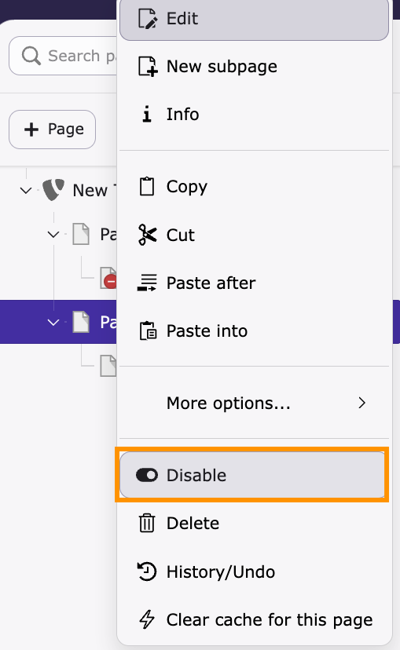
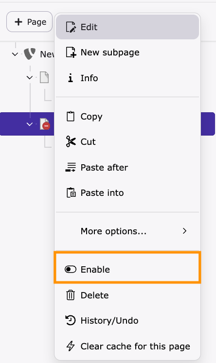
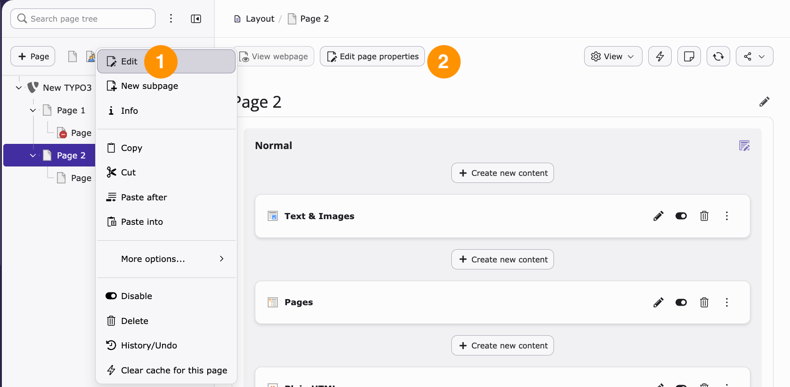
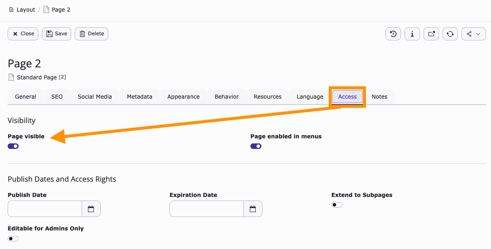

# Hide and show pages

<!-- #TYPO3v14 #Beginner #Backend #Editing @dhubert974 -->

TYPO3 allows editors to control whether pages are visible on the website without deleting them.

Hiding pages is useful when content is not ready, temporarily unavailable, or no longer needed online. You can show pages again at any time.

## Learning objective

In this step-by-step guide, you will learn how to:

* Hide a page from the page tree
* Make a hidden page visible again
* Understand how page visibility affects navigation

## Prerequisites

### Tools and technology

* A TYPO3 v14 installation
* Access to the TYPO3 backend
* Permissions to edit page settings

### Knowledge and skills

* Basic understanding of the TYPO3 backend
* Familiarity with the page tree

## Hide a page in the page tree

You can quickly hide a page directly from the page tree.

1. Locate the page you want to hide in the page tree.
2. Right-click the page and select **Disable**.

### Result

The page is now hidden from the website.

A hidden page appears with a **Restricted access** icon in the page tree, making it easy to identify.

## Show a hidden page

You can restore visibility for hidden pages at any time.

1. Locate the hidden page in the page tree.
2. Right-click the page and select **Enable**.

### Result

The page becomes visible on the website again.

The page returns to its normal appearance in the page tree.

## Hide or show a page from page properties

You can also control visibility from the page settings.

1. Select the page in the page tree.
2. Open the page properties. You have two options:
   * Right-click the page in the page tree and select **Edit**
   * On the page, select **Edit page properties**

   

3. Open the **Access** tab.
4. Enable or disable the **Page visible** option.

   

5. Save your changes.

### Result

The page visibility is updated according to the selected setting.

This method is useful when editing additional page settings at the same time.

## Summary

Congratulations! You now know how to hide and show pages in TYPO3.

You learned how to:

* Hide pages from the page tree
* Make hidden pages visible again
* Manage page visibility from page properties

## Next steps

Now that you can manage page visibility, you might like to:

* Edit page properties
* Schedule page publication
* Restrict page access
* Create and organize pages

## Resources

* TYPO3 page management documentation
