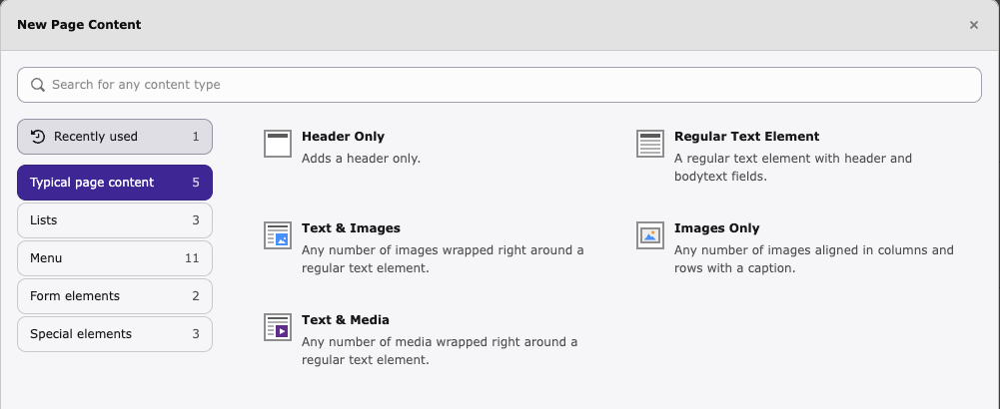
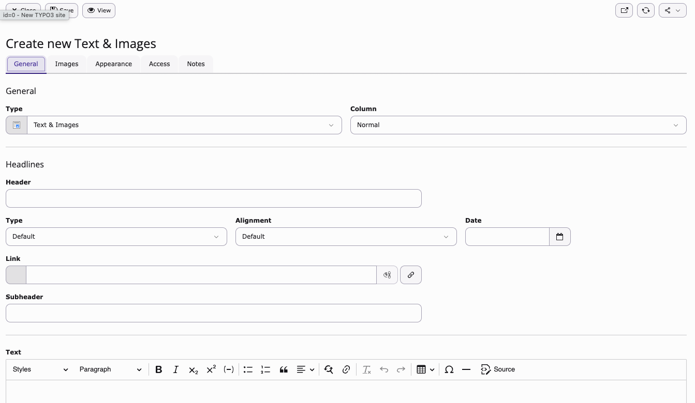
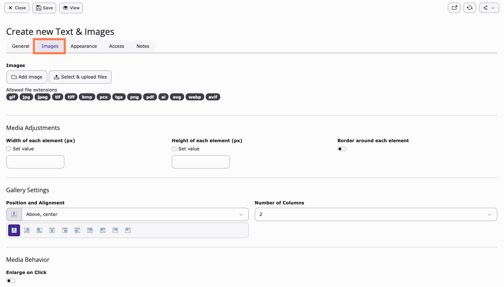
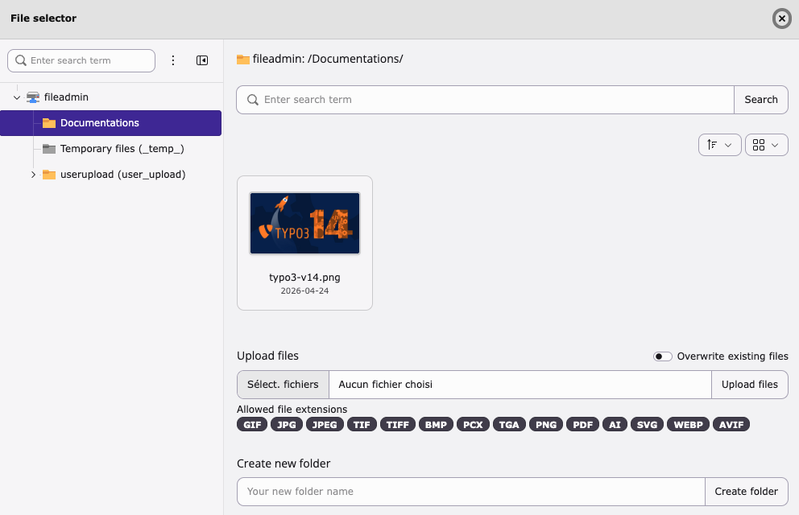
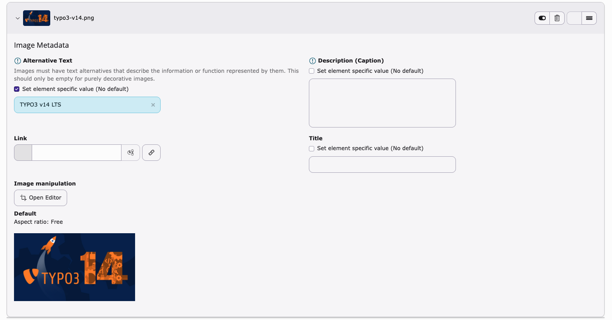
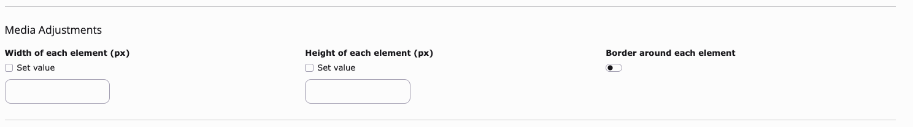
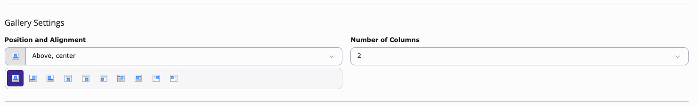
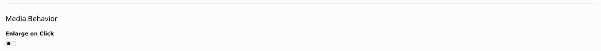

# Insert images into text content

<!-- #TYPO3v14 #Beginner #ContentElements #Backend #Editing #Images #RichTextEditor @delfynn2kx -->

The **Insert images into text content** feature enables you to enrich written content with visuals. Learning how to insert images into text content helps you create visually appealing pages and improve communication with your audience.

## Learning objective

In this step-by-step guide you will learn how to insert images into a text content element and configure basic image settings such as alignment and captions.

## Prerequisites

### Tools and technology

* Access to the TYPO3 backend
* Permission to create or edit content elements
* At least one image available for upload

### Knowledge and skills

* Know how to log in to the TYPO3 backend
* Know how to create a page
* Know how to create a content element

## Create a text content element

TYPO3 provides several content elements that allow you to add images.

You can choose from the following options:

* **Text & Images** — Displays images together with text.
* **Images Only** — Displays images without text.
* **Text & Media** — Displays text together with media such as images or videos.

> [!NOTE]
> The procedure for adding images is very similar for **Text & Images**, **Images Only**, and **Text & Media** content elements.
>
> This guide uses **Text & Images** as an example, but the same steps apply to the other content types.

To insert an image into text content, first create a content element that supports images.

### Steps

1. Select the page where you want to add content.
2. Click **Create new content**.
3. In the **Typical page content** tab, select **Text & Images**.

A new **Text & Images** content element is created and ready to be edited.

## Add an image to the content element

TYPO3 allows you to select an existing file from the Media module or upload a new file directly from your computer.

### Steps

1. In the **Text & Images** content element, open the **Images** tab. This tab allows you to add and manage the images used in this content element.

2. Add an image using one of the following options.

### Option 1 — Add an existing image

1. Click **Add image**.

   This opens the **File selector** dialog.

2. Select the desired folder.
3. Select the image you want to use.

The selected image is added to the content element.

### Option 2 — Upload a new image

1. Click **Select & upload files**.

2. Select the image from your computer.
3. Click **Upload files**.

The uploaded image is added to the content element.

> [!TIP]
> You can upload multiple images at once by selecting several files before clicking **Upload files**.

## Configure image settings

After adding an image, you can configure metadata and display settings to control how the image appears on the page.

These settings help improve accessibility, layout, and user experience.

### Steps

After adding the image, configure the available options.

1. **Configure Image Metadata**

   This section controls accessibility and descriptive information. Update the following fields:

   * **Alternative Text** — Describe the image for accessibility.
   * **Description (Caption)** — Add a caption displayed below the image.
   * **Link** — Add a link if the image should be clickable.
   * **Title** — Add a tooltip title.
   * **Image manipulation** — Crop the image to focus on the desired area. *(Default aspect ratio: Free)*

   

2. **Adjust Media Adjustments**

   This section controls the image size and visual frame. Configure:

   * Width of each element (px)
   * Height of each element (px)
   * Border around each element *(Enable if needed — default is disabled)*

   

3. **Configure Gallery Settings**

   This section controls alignment and layout. Configure:

   * **Position and Alignment** (for example: Above center, Left, Right, etc.)
   * **Number of Columns**

   

4. **Configure Media Behavior**

   This section controls image interaction. Configure:

   * **Enlarge on Click** *(Default: disabled)*

   Enable this option to allow visitors to open a larger version of the image when clicking it.

   

Click **Save** and **View** to preview the result, or just **Close** your content element.

## Summary

Congratulations! You now have successfully inserted an image into a text content element and configured its display settings.

You can now enhance your pages by adding visual content that improves readability and engagement.

## Next steps

Now that you have inserted images into text content, you might like to:

* Format text inside the Rich Text Editor
* Create links inside content
