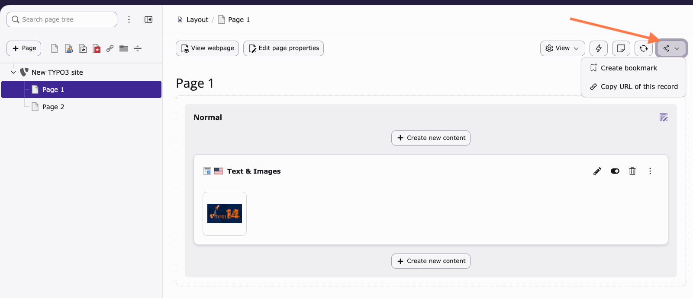
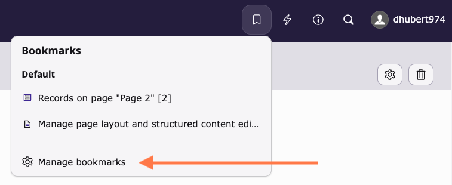
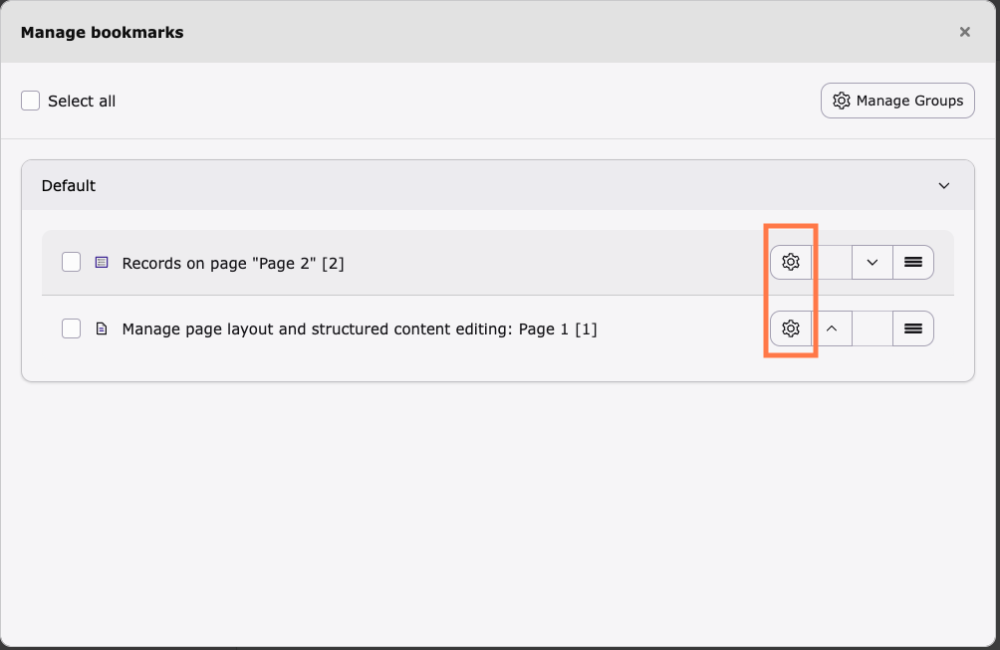
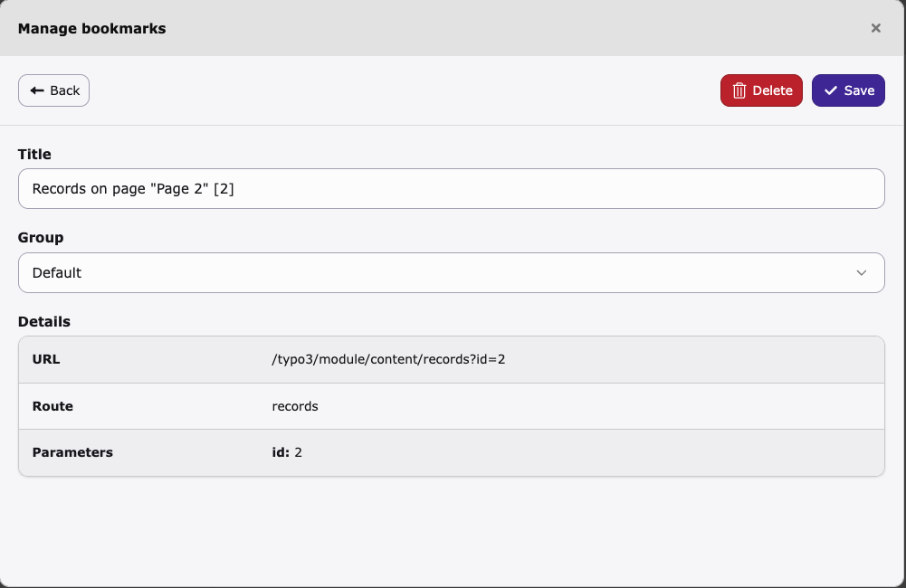
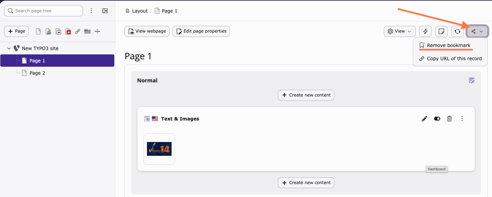

# Manage bookmarks in the TYPO3 backend

<!-- #TYPO3v14 #Beginner #Backend #Editing @dhubert974 -->

Bookmarks in the TYPO3 backend allow editors and administrators to quickly access frequently used pages or modules without navigating through the page tree every time.

Managing bookmarks helps you save time and streamline your daily workflow in the backend.

## Learning objective

In this step-by-step guide you will learn how to create, access, and manage bookmarks in the TYPO3 backend.

## Prerequisites

### Tools and technology

* A working TYPO3 v14 instance
* Access to the TYPO3 backend

### Knowledge and skills

* Basic knowledge of the TYPO3 backend interface
* Ability to navigate pages and modules

## Create a bookmark

You can create a bookmark for any page you frequently use.

1. Open the **Content > Layout** module.
2. Select the page you want to bookmark from the page tree.
3. Locate the **document header** at the top of the screen.
4. Click the **share icon**.
5. Click **Create bookmark**.

## Access your bookmarks

Once bookmarks are created, a list of your saved bookmarks is displayed. Click any bookmark to open it directly.

1. Locate the **administrative toolbar** at the top of the backend.
2. Click the **Bookmark icon**.

## Manage bookmarks

You can organize or remove bookmarks as needed. TYPO3 provides multiple ways to manage them. Choose the method that best fits your workflow.

### Option 1: Manage bookmarks from the toolbar

1. Click the **Bookmark icon** in the administrative toolbar.
2. Select **Manage bookmarks**.

   

3. Review your bookmarks in the dialog.
4. Click the **gear icon** next to a bookmark.

   

5. Click **Delete** to remove the bookmark.

   

### Option 2: Remove a bookmark from a page

You can also remove a bookmark directly while viewing the bookmarked page.

1. Open a bookmarked page.
2. In the **document header**, click the **share icon**.
3. Click **Remove bookmark**.

## Summary

You have learned how to create, access, and manage bookmarks in the TYPO3 backend.

Congratulations! You now have a faster way to navigate to your frequently used pages.

## Next steps

Now that you have learned how to manage bookmarks, you might like to:

* Explore the TYPO3 backend interface
* Locate and use the TYPO3 backend's administrative toolbar
* Customize your user settings in the TYPO3 backend
