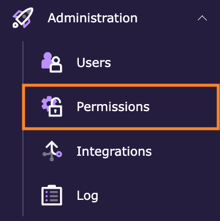
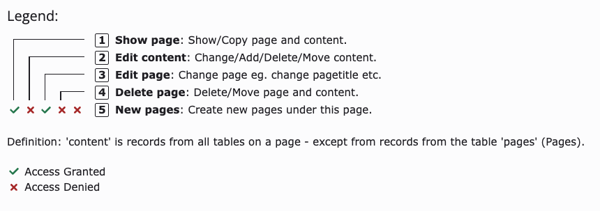
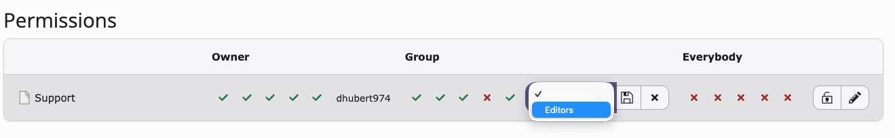
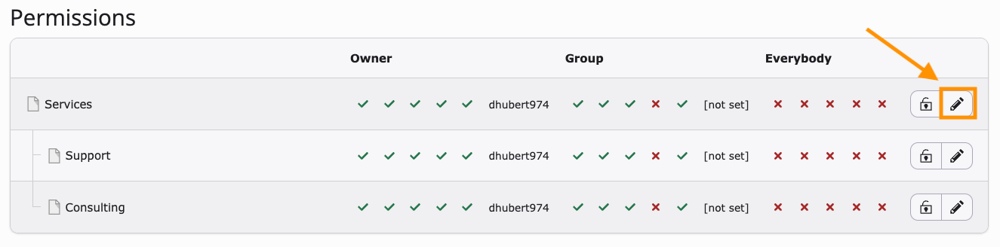
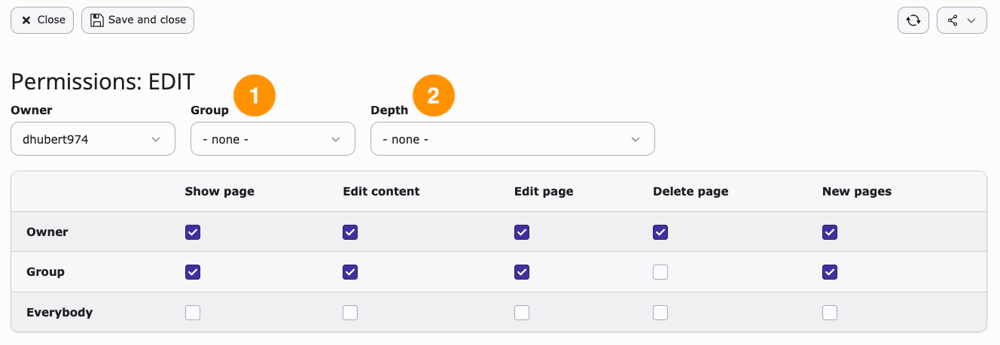
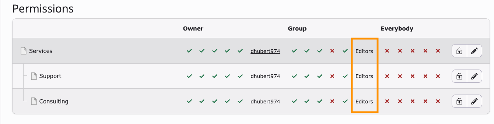

# Manage page permissions

<!-- #TYPO3v14 #Beginner #Backend #Editing @dhubert974 -->

Managing page permissions in TYPO3 allows administrators and authorized editors to control who can view, edit, delete, or create content on specific pages.

Permissions help teams collaborate safely by ensuring users only have access to the pages and actions relevant to their role.

## Learning objective

In this step-by-step guide you will learn how to manage page permissions in TYPO3 using the **Permissions** module.

## Prerequisites

### Tools and technology

* Access to a TYPO3 backend
* Permission to manage page permissions
* A TYPO3 website with existing backend users or groups

### Knowledge and skills

* Basic understanding of the TYPO3 page tree
* Familiarity with TYPO3 backend navigation

## Open the Permissions module

The **Permissions** module helps you define who can access and modify content within the page tree.

1. Open the TYPO3 backend and navigate to **Administration > Permissions**.

   

2. Select the page where you want to manage permissions.

   **Expected outcome:** The selected page displays its current permissions.

## Review existing permissions

Before making changes, review the current configuration.

1. Locate the permissions overview table. By default, the group is **[not set]**.

   ![The Permissions overview table showing the Owner, Group and Everybody columns, with the group set to "[not set]"](Images/ManagePagePermissions/permission-default.png)

2. Review the available permission columns.

   

   Typical permissions may include:

   * **Show page**: Show/Copy page and content
   * **Edit content**: Change/Add/Delete/Move content
   * **Edit page**: Change page, e.g. change page title
   * **Delete page**: Delete/Move page and content
   * **New pages**: Create new pages under this page

You understand the current permission setup for the selected page.

## Modify page permissions

You can adjust permissions depending on who should manage the page.

1. Click **[not set]** for the selected page.

   ![The Permissions overview table with an arrow pointing to the "[not set]" group value](Images/ManagePagePermissions/permission-modify.png)

2. Select the backend user group whose permissions you want to modify.

   

3. Save your changes.

   **Expected outcome:** The updated permissions are applied to the page.

## Apply permissions to subpages (optional)

If needed, permissions can be propagated to child pages.

1. Choose the edit icon (pencil) on the parent page.

   

2. Select the group in the **Group** field (1), then choose **Set recursively x levels (x pages affected)** in the **Depth** field (2).

   

3. Click **Save and close**.

Child pages inherit the selected permissions.

## Summary

Congratulations! You now know how to manage page permissions in TYPO3.

## Next steps

Now that you have managed page permissions, you might like to:

* Create backend user groups
* Learn how backend user groups work
* Hide or unhide pages

## Resources

* TYPO3 Backend User Guide
* TYPO3 Permissions documentation
