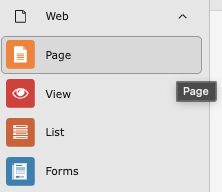
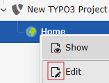
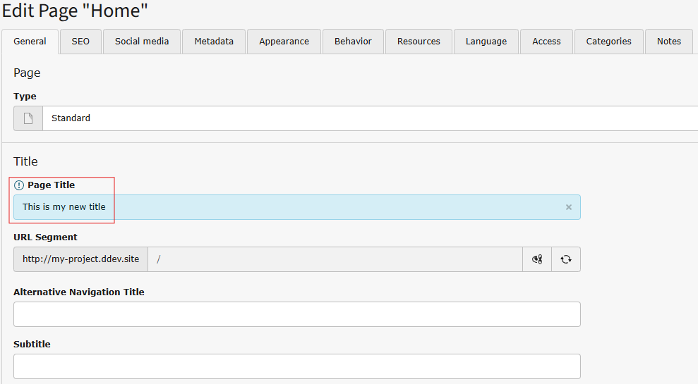
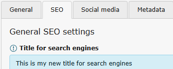
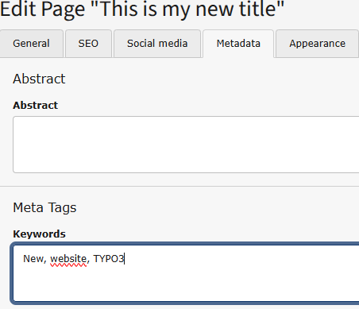

# Modifying the page properties

<!-- #TYPO3v00 #Beginner #Intermediary #Advanced #ContentElements #Frontend #Backend #Templating #Server #Editing #Configuration @username -->

Modifying page properties in TYPO3 enables you to control how each page of your site behaves, appears, and is structured within the overall site hierarchy. From basic settings like titles, visibility, and URL segments to more advanced options such as access restrictions, metadata, and caching behavior, page properties give you fine-grained control over both the frontend presentation and backend organization of your content.

## Learning objective

In this step-by-step guide you will learn how to access, edit, and manage the following page properties in TYPO3 :

* Page Title
* Title for search engines
* Keywords for Meta data

 The same steps will apply if you need to modify other page properties.

## Prerequisites

### Tools and technology

* A computer with a local TYPO3 installation
* Access to the TYPO3 backend (editor or admin account)
* A web browser

### Knowledge and skills

* You know how to log in into the TYPO3 backend
* You know how to open the **Page** module

## Watch the video

{**Optional**. If available, embed the YouTube video version of this tutorial from the TYPO3 official channel.}

Watch this video to follow along with the steps below.

## Modify a page properties

1. In the backend, open the **Page** module from the left-hand menu.

   

2. Click on the icon of the page you want to modify.

   

3. In the General Tab, modify the field *Page title*.
   
   

4. In the SEO Tab, modify the field *Title for search engines*.
   
   

5. In the Metadata Tab, modify the field *Keywords*.
   
   

6. Save your modifications.

## Summary

You updated the properties of a TYPO3 page by accessing its settings and modifying key fields such as the page title, SEO title, and metadata keywords. This allows you to improve how the page is displayed to users, how it appears in search results, and how it fits into the overall structure and organization of your website.

## Next steps

Now that you have modifying the page properties, you might like to:

* [Add content to your page](https://docs.typo3.org/permalink/t3editors:content-creating)

## Resources

* [Page properties](https://docs.typo3.org/permalink/t3editors:pages-properties)