# Move and organize pages in the page tree

<!-- #TYPO3v14 #Beginner #Intermediary #Backend #Editing @dhubert974 -->

Managing pages efficiently in the page tree helps editors keep website content structured and easy to maintain. TYPO3 provides built-in tools to move, copy, and reorganize pages directly in the backend.

Learning how to organize pages in the page tree helps you maintain a clean site structure, reorganize content, and improve collaboration between editors.

## Learning objective

In this step-by-step guide, you will learn how to:

* Move pages within the page tree
* Reorganize page structures using drag and drop
* Copy or relocate pages safely
* Understand how page placement affects website navigation

## Prerequisites

### Tools and technology

* A TYPO3 v14 installation
* Access to the TYPO3 backend
* Permissions to edit and move pages in the page tree

### Knowledge and skills

* Basic understanding of TYPO3 backend navigation
* Familiarity with the page tree and page module

## Move a page using drag and drop

TYPO3 allows you to reorganize pages directly in the page tree using drag and drop.

1. Open the **Content > Layout** module.

   

2. Locate the page you want to move in the page tree.

   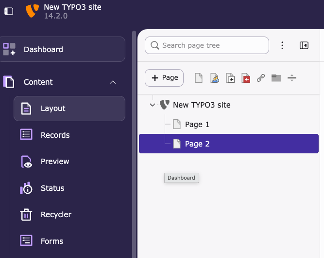

3. Click and hold the page title.
4. Drag the page to a new position in the page tree.

   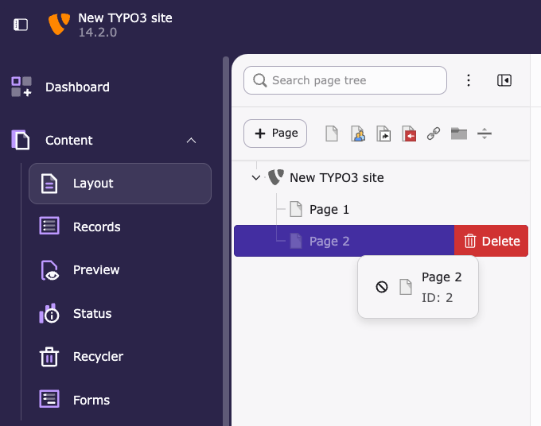

5. Release the mouse button when the placement indicator appears.
6. A confirmation message for the move opens in a dialog box.

   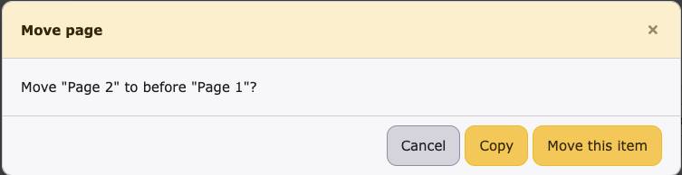

### Result

The page now appears in its new location in the page tree.

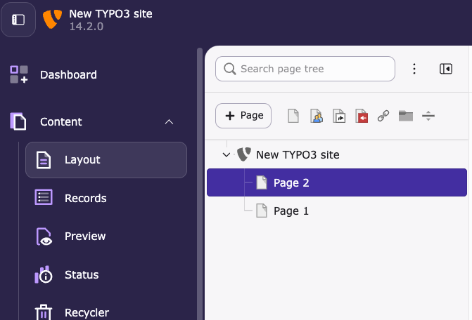

> [!TIP]
> Watch the placement indicator carefully before dropping the page:
>
> * Place a page **between pages** to reorder it at the same level.
> * Place a page **on another page** to make it a subpage.

## Move a page using Cut and Paste

This method is useful when working with large page trees or when drag and drop becomes difficult.

1. Right-click the page you want to move in the page tree.
2. Select **Cut**.

   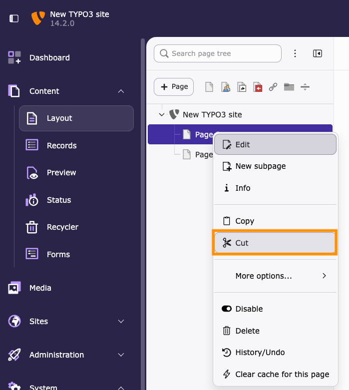

3. Navigate to the location in the page tree where you want to move the page and right-click again.
4. Select **Paste after** (1) or **Paste into** (2).

   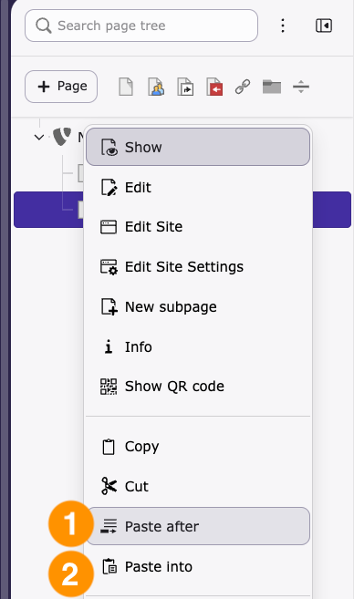

5. Confirm the move in the dialog box.

   **Paste after**

   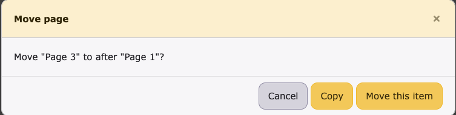

   **Paste into**

   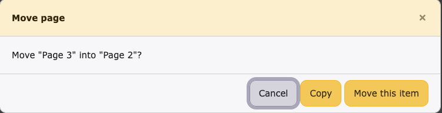

### Understanding page placement

The result depends on the option you choose.

#### Paste after

Select **Paste after** to place the page at the same level in the page tree.

The moved page stays at the same level and appears directly below the selected page.

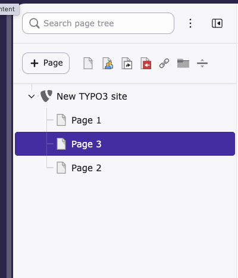

#### Paste into

Select **Paste into** to place the page inside another page.

The moved page becomes a child page in the page tree.

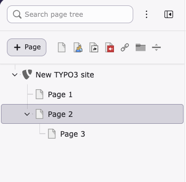

## Copy a page to another location

Sometimes you may want to duplicate a page instead of moving it.

1. Right-click the page you want to duplicate and select **Copy**.

   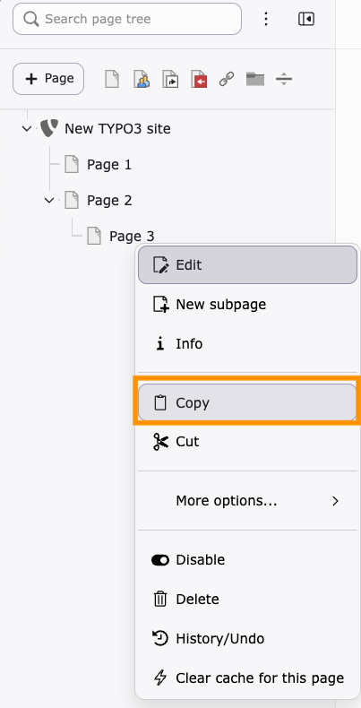

2. Navigate to the target location and choose **Paste after** or **Paste into** again.

   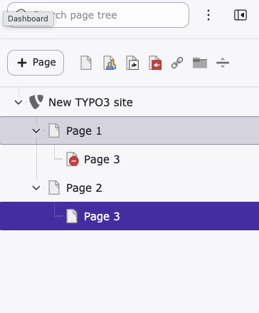

TYPO3 creates a duplicate page and includes its content.

## Organize pages using page hierarchy

Keeping a clear structure makes websites easier to maintain.

When organizing pages:

* Group related pages under parent sections
* Avoid overly deep nesting when possible
* Use clear and consistent page names
* Reorganize outdated content regularly

A well-structured page tree improves navigation for editors and helps maintain content consistency.

## Summary

Congratulations! You now know how to move and organize pages in the TYPO3 page tree.

You learned how to:

* Move pages using drag and drop
* Use copy, paste after and paste into
* Keep a clear and maintainable page hierarchy

## Next steps

Now that you have organized pages in the page tree, you might like to:

* Edit page properties
* Create new pages
* Hide and show pages

## Resources

* TYPO3 backend editing documentation
* TYPO3 page tree documentation
