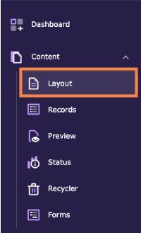
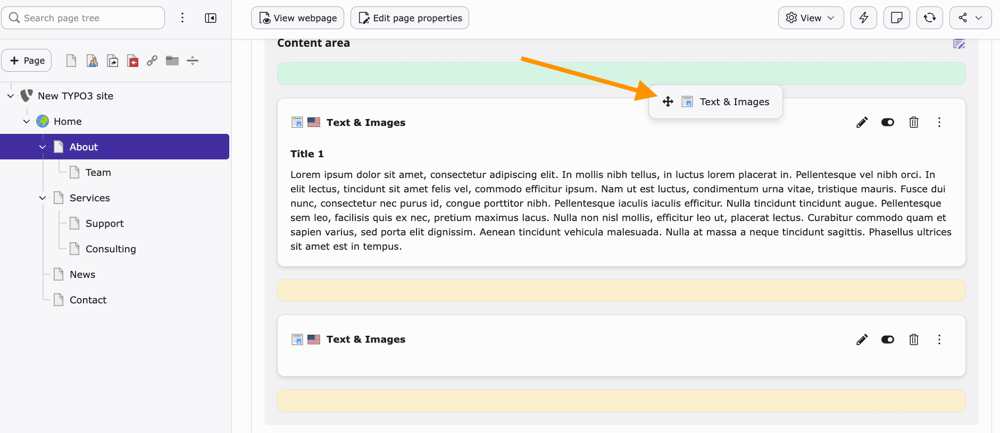

# Move content elements on a page

<!-- #TYPO3v14 #Beginner #ContentElements #Backend #Editing #DragAndDrop @dhubert974 -->

TYPO3 allows you to easily reorganize content on a page using drag and drop. This helps you control the visual order of elements without modifying templates or code.

## Learning objective

In this step-by-step guide you will learn how to move content elements within a page.

## Prerequisites

### Tools and technology

* TYPO3 v14 backend access
* A page containing multiple content elements

### Knowledge and skills

* Basic navigation in the TYPO3 backend
* Understanding of content elements

## Move content elements using drag and drop

1. Navigate to the **Layout module** in the TYPO3 backend.

   

2. Select the page and locate the content element you want to move.
3. Click and hold the **drag handle (move icon)** on the content element.
4. Drag the element to a new position within the same column or content area.

   While dragging, TYPO3 displays visual indicators:

   * **Green bars** show valid drop positions where the content element can be placed.
   * **Yellow highlights or areas** indicate the current target zone or potential drop area, depending on the backend layout.

5. Release the mouse button to drop the element into its new position.

## Summary

You have successfully moved content elements using drag and drop in TYPO3. This allows you to quickly adjust page structure without technical changes.

Congratulations! You now know how to organize content visually in the TYPO3 backend.

## Next steps

Now that you can reorder content elements, you might like to:

* Delete, hide and restore content elements
* Create new content elements
* Schedule content element publication

## Resources

* TYPO3 Backend Module: Page
* TYPO3 Content Element Guide
* TYPO3 v14 Documentation
