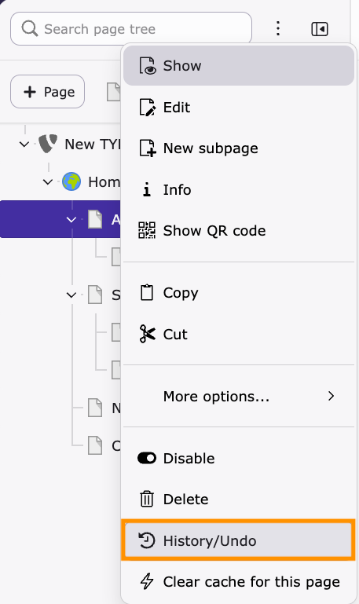
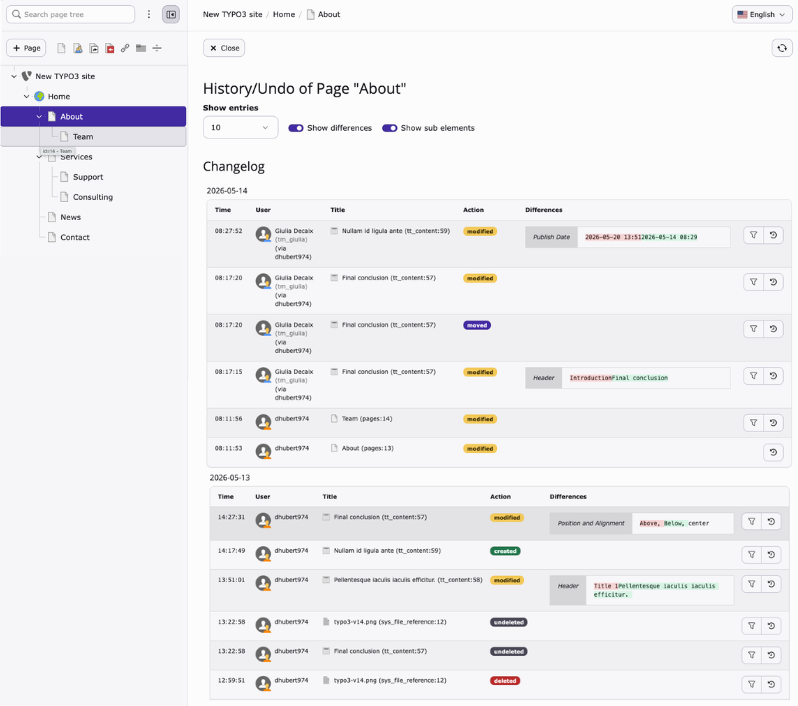
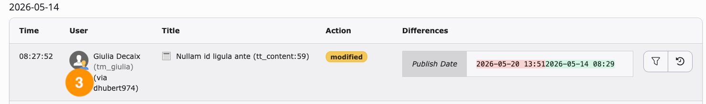
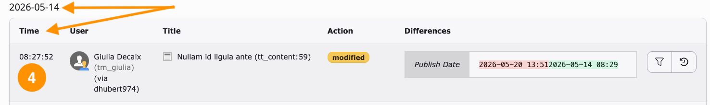
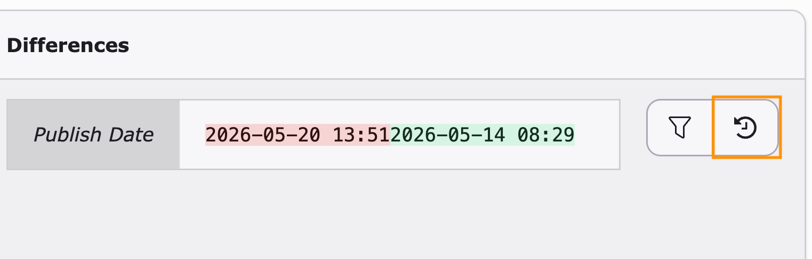
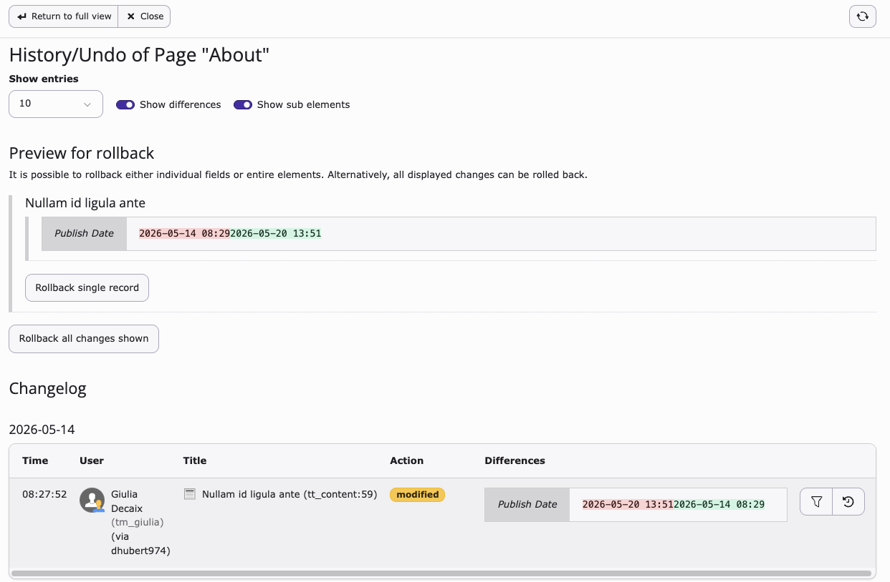
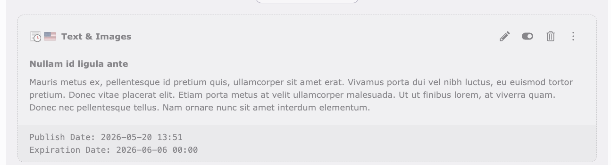

# Review page changes using page history

<!-- #TYPO3v14 #Beginner #Backend #Editing @dhubert974 -->

TYPO3 records every change made to a page and to the content elements on it. The **History/Undo** module turns that record into a readable changelog: you can see what changed, who changed it, and when. If a change was made by mistake, you can roll it back to the previous value — one field, one record, or everything shown at once.

## Learning objective

In this step-by-step guide you will open the history of a page, identify who modified its content and when, and restore a previous version of a record.

## Prerequisites

### Tools and technology

* Backend access to a TYPO3 installation
* A page that has already been edited at least once, so that its history is not empty

### Knowledge and skills

* You know how to [Log in to the TYPO3 backend](LogInToTheTypo3Backend.md)
* [Basic knowledge of the TYPO3 backend](https://docs.typo3.org/permalink/t3start:backend)

## Open the page history

1. In the module menu, choose the **Page** module.
2. In the page tree, right-click the page you want to inspect and choose **History/Undo** from the context menu.

   

   The **History/Undo** module opens and displays the changelog of the selected page, grouped by date. Each row is one change to the page itself or to one of its records.

   

> [!TIP]
> Use **Show entries** to change how many changes are listed, and the **Show differences** and **Show sub elements** toggles to include the field-by-field comparison and the changes made to the records on the page.

## Review the changes

The changelog answers three questions for every entry: what changed, who changed it, and when.

1. Read the **Differences** column to see what changed. The previous value is highlighted in red (1) and the new value is highlighted in green (2).

   

   The **Title** column tells you which record was affected. In the screenshot above, the change applies to a content element (`tt_content:59`); rows that refer to the page itself show the page record instead (`pages:13`).

2. Read the **User** column (3) to see who made the change. When an editor worked on behalf of another backend user, the acting user is shown in brackets after *via*.

   

3. Read the date heading above the table and the **Time** column (4) to see when the change occurred.

   

## Restore a previous version

If a change was made by mistake, roll it back from the same changelog.

1. Locate the change you want to undo in the changelog.
2. Click the **Rollback** icon at the end of the row.

   

   The **Preview for rollback** section appears above the changelog and shows the values that will be restored.

3. Click **Rollback single record** to restore the record shown in the preview.

   

   > [!NOTE]
   > **Rollback single record** undoes the change for the selected record only. **Rollback all changes shown** undoes every change currently listed in the changelog, so use it with care.

4. Close the **History/Undo** module and check the record on the page to confirm that the previous value is back.

   In this example, the content element "Nullam id ligula ante" was scheduled to be published on 2026-05-20, but the publish date had been changed to 2026-05-14. After the rollback, the content element is scheduled for 2026-05-20 again.

   

## Summary

Congratulations! You can now use **History/Undo** to review the changelog of a page, identify who changed what and when, and restore a previous version of a record when a change was made by mistake.

## Next steps

Now that you can review and undo page changes, you might like to:

* [Modifying the page properties](ModifyingThePageProperties.md)
* [Enabling and disabling a page in the page tree](EnablingAndDisablingAPageInThePageTree.md)

## Resources

* [Introduction to the TYPO3 Backend](https://docs.typo3.org/permalink/t3start:backend)
* [Add content elements](AddContentElements.md)
