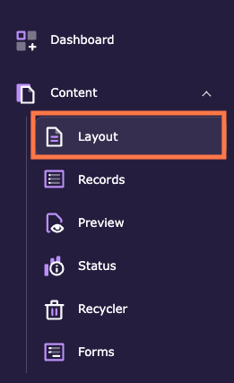
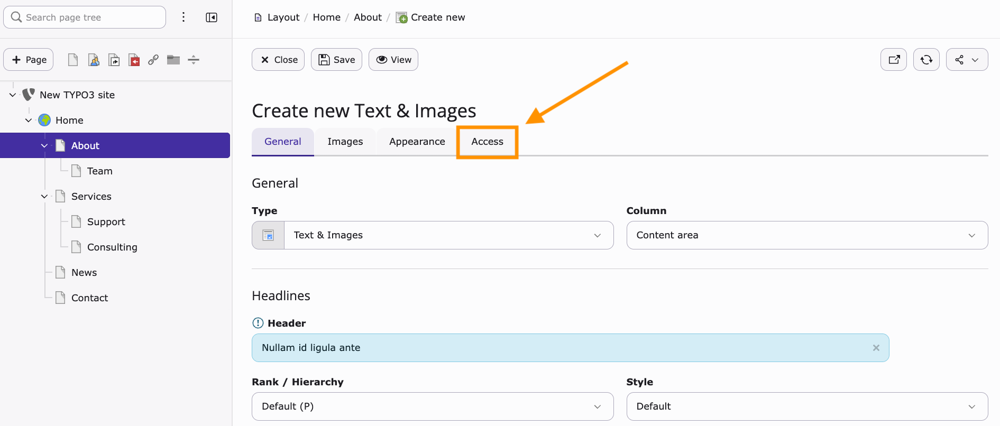
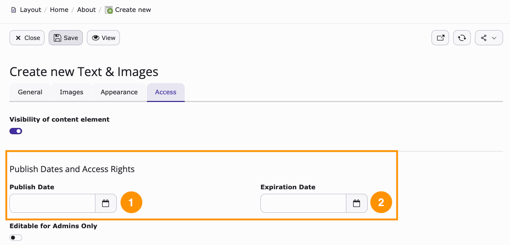
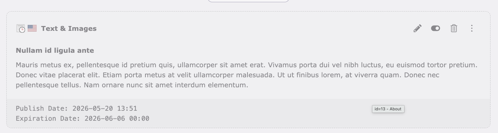

# Schedule content element publication

<!-- #TYPO3v14 #Beginner #Backend #ContentElements #Editing @dhubert974 -->

Content is not always ready to go live the moment you finish writing it, and it is not always meant to stay online forever. A press release may need to appear on a fixed date, and a banner announcing an event should disappear once the event is over. Instead of publishing and unpublishing by hand, you can let TYPO3 do it for you: every content element has a **Publish Date** and an **Expiration Date** in its **Access** tab. TYPO3 shows the element in the frontend only within that time frame.

## Learning objective

In this step-by-step guide you will schedule the publication of a content element by setting a publish date, add an optional expiration date, and check the result in the **Layout** module.

## Prerequisites

### Tools and technology

* Backend access to a TYPO3 v14 installation
* A backend user with permission to edit content elements
* A page that contains at least one content element

### Knowledge and skills

* You know how to [Log in to the TYPO3 backend](LogInToTheTypo3Backend.md)
* You know how to [Add content elements](AddContentElements.md)
* [Basic knowledge of the TYPO3 backend](https://docs.typo3.org/permalink/t3start:backend)

## Open the Access tab of a content element

1. In the module menu, choose **Content** > **Layout**.

   

2. In the page tree, select the page that holds the content element you want to schedule.
3. Create a new content element, or open an existing one for editing.
4. In the editing form, open the **Access** tab.

   

## Schedule the publication

The **Access** tab groups everything that controls when and to whom the element is shown. The publication schedule lives in the **Publish Dates and Access Rights** section: **Publish Date** (1) defines when the element appears, **Expiration Date** (2) defines when it disappears again.

1. Click the calendar icon next to **Publish Date** and pick the day on which the content should go live. Set the hour and the minute at the bottom of the date picker.

   

   From now on, the element stays invisible in the frontend until that moment, and appears automatically afterwards.

2. **Optional:** Click the calendar icon next to **Expiration Date** and pick the day on which the content should disappear again. Leave the field empty if the element is meant to stay online indefinitely.

   

3. Click **Save**, then **Close** to return to the **Layout** module.

> [!NOTE]
> The publish date only works on an element that is visible. If the **Visibility of content element** toggle at the top of the **Access** tab is switched off, the element stays hidden in the frontend, no matter which dates you set.

## Check the schedule in the Layout module

In the **Layout** module, a scheduled content element is dimmed and marked with a clock icon, and its publish and expiration dates are listed at the bottom of the element.

This is what editors see in the backend, and it is the quickest way to confirm that the schedule was saved. Visitors do not see the element at all until the publish date is reached.

> [!TIP]
> If the element does not appear in the frontend right after the publish date has passed, the page may still be served from the cache. See [Clearing the frontend cache in the TYPO3 backend](ClearingFrontendCacheInTypo3Backend.md).

## Summary

Congratulations! You can now schedule a content element to be published at a given date and time, let it expire automatically, and recognise a scheduled element in the **Layout** module. Publication and expiration dates take time-sensitive content off your to-do list: you prepare it once, and TYPO3 puts it online and takes it offline for you.

## Next steps

Now that you can schedule a single content element, you might like to:

* [Add content elements](AddContentElements.md) to prepare the content you want to schedule
* [Enabling and disabling a page in the page tree](EnablingAndDisablingAPageInThePageTree.md) to control the visibility of a whole page
* [Modifying the page properties](ModifyingThePageProperties.md), where pages offer the same publish and expiration dates

## Resources

* [Working with content elements in the TYPO3 Editors Tutorial](https://docs.typo3.org/permalink/t3editors:content-working)
* [Introduction to the TYPO3 backend](https://docs.typo3.org/permalink/t3start:backend)
