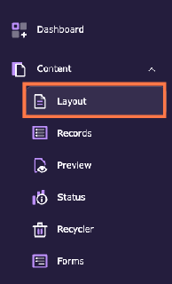
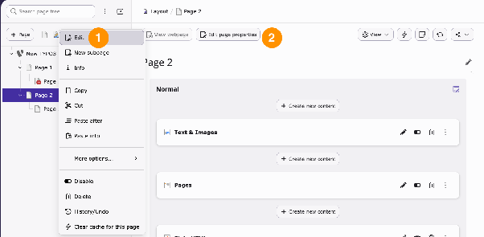
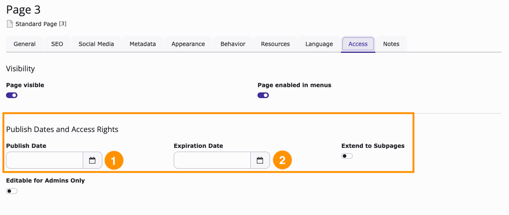
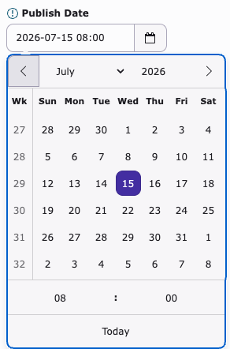
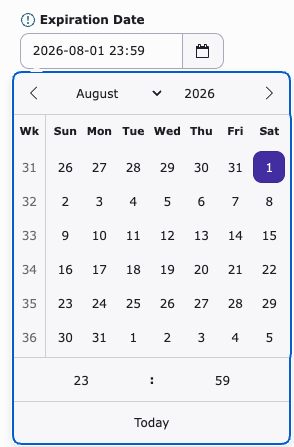
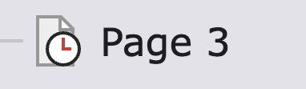

# Schedule page publication

<!-- #TYPO3v13 #Beginner #Backend #Editing @dhubert974 -->

A page is not always meant to be online the moment you finish it, and it is not always meant to stay online forever. A seasonal campaign should go live on the day the campaign starts; a page announcing an event should disappear once the event is over. Rather than publishing and unpublishing by hand — and remembering to do it at the right moment — you can let TYPO3 handle it: every page has a **Publish Date** and an **Expiration Date** in its page properties. TYPO3 shows the page in the frontend only within that time frame.

## Learning objective

In this step-by-step guide you will schedule a page to be published at a given date and time, add an optional expiration date, and recognise a scheduled page in the page tree.

## Prerequisites

### Tools and technology

* Backend access to a TYPO3 v13 installation
* A backend user with permission to edit pages
* A TYPO3 website with at least one editable page

### Knowledge and skills

* You know how to [Log in to the TYPO3 backend](LogInToTheTypo3Backend.md)
* You are familiar with the TYPO3 page tree and with [Modifying the page properties](ModifyingThePageProperties.md)

## Open the page properties

1. In the module menu, choose **Content** > **Layout**.

   

2. In the page tree, select the page you want to schedule.
3. Open the page properties. You have two ways to do this:
   * Right-click the page in the page tree and choose **Edit** (1), or
   * Click **Edit page properties** (2) in the toolbar above the page.

   

4. In the editing form, open the **Access** tab.

   

## Schedule the publication

The **Access** tab groups everything that controls when and to whom the page is shown. The publication schedule lives in the **Publish Dates and Access Rights** section: **Publish Date** (1) defines when the page goes live, **Expiration Date** (2) defines when it disappears again.

1. Click the calendar icon next to **Publish Date** and pick the day on which the page should go live. Set the hour and the minute at the bottom of the date picker.

   

   From now on, the page stays invisible in the frontend until that moment, and appears automatically afterwards.

2. **Optional:** Click the calendar icon next to **Expiration Date** and pick the day on which the page should go offline again — useful for a temporary campaign page. Leave the field empty if the page is meant to stay online indefinitely.

   

3. **Optional:** Switch on **Extend to Subpages** if the same dates should apply to every page below this one.
4. Click **Save**, then **Close**.

> [!NOTE]
> A page is only reachable if its parent pages are reachable too. If a page further up the tree is hidden, scheduled for a later date, or restricted to certain user groups, the pages below it stay inaccessible regardless of their own dates.

## Check the schedule in the page tree

A page that has a publish or an expiration date is marked with a clock icon in the page tree, which makes a scheduled page easy to spot among its siblings.

> [!TIP]
> If the page does not appear in the frontend right after the publish date has passed, the site may still be served from the cache. See [Clearing the frontend cache in the TYPO3 backend](ClearingFrontendCacheInTypo3Backend.md).

## Summary

Congratulations! You can now schedule a page to be published at a given date and time, let it expire automatically, extend the schedule to its subpages, and recognise a scheduled page by the clock icon in the page tree. Publication and expiration dates take time-sensitive pages off your to-do list: you prepare them once, and TYPO3 puts them online and takes them offline for you.

## Next steps

Now that you can schedule a whole page, you might like to:

* [Schedule content element publication](ScheduleContentElementPublication.md) to control single elements on a page instead
* [Enabling and disabling a page in the page tree](EnablingAndDisablingAPageInThePageTree.md) to take a page offline right away
* [Create a page with drag and drop](CreateAPageWithDragAndDrop.md) to prepare the next page you want to schedule

## Resources

* [Page properties in the TYPO3 Editors Tutorial](https://docs.typo3.org/permalink/t3editors:pages-properties)
* [Introduction to the TYPO3 backend](https://docs.typo3.org/permalink/t3start:backend)
