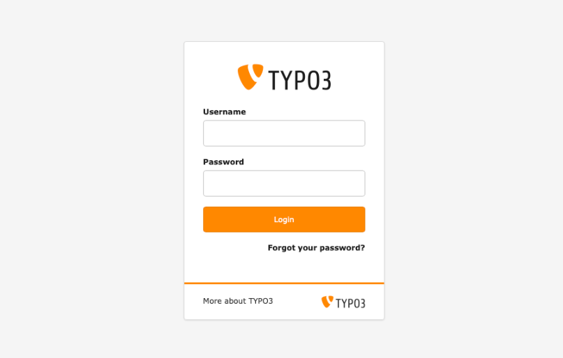

# Search for content in the TYPO3 backend

<!-- #TYPO3v13 #Beginner #Backend #ContentElements #Editing @dhubert974 -->

On a small site you can find anything by clicking through the page tree. On a large one you cannot: a single page title may sit five levels down, inside a folder you did not build, next to a hundred others. The backend search saves you that walk. Type what you remember — a page title, a heading, the name of a record — and TYPO3 lists what matches, wherever it lives in the tree.

## Learning objective

In this step-by-step guide you will use the TYPO3 backend search to find pages and content elements by keyword, narrow the results down, and open the record you were looking for.

## Prerequisites

### Tools and technology

* Backend access to a TYPO3 v13 installation
* A backend user with at least editing permissions
* A TYPO3 installation that already holds some content

### Knowledge and skills

* [Basic knowledge of the TYPO3 backend](https://docs.typo3.org/permalink/t3start:backend)
* You are familiar with pages and content elements

## Search for content

What the search covers depends on how your installation is configured, but it will normally reach both pages and the records stored on them.

1. Log in to the TYPO3 backend.

   

2. Find the search field in the **administrative toolbar** at the top of the backend.
3. Enter a keyword for what you are looking for — a page title, the heading of a content element, or the name of a record.
4. Press **Enter**, or click the search icon.

TYPO3 lists the pages, content elements and records that match your keyword.

## Narrow down the results

If the list is too long to be useful, work through it like this:

* **Use a more specific keyword.** A distinctive word from the heading beats a common one.
* **Check the record type.** The results mix pages, content elements and other records, so read the type before you judge a hit.
* **Open a result to confirm it.** The title alone does not always tell you whether it is the one you want.

## Open a result

1. Click a result in the list.

   TYPO3 takes you straight to that record — in the page tree, or in the module the record belongs to.

2. View or edit the content as usual.

## Summary

Congratulations! You can now find content in the TYPO3 backend by keyword instead of hunting through the page tree, narrow a long result list down to the record you want, and open it straight from the results. On a site with hundreds of pages, that turns a search into a few seconds of typing.

## Next steps

Now that you can search for content, you might like to:

* [Add content elements](AddContentElements.md) to the pages you find
* [Enabling and disabling a page in the list module](EnablingAndDisablingAPageInTheListModule.md), one of the modules the search takes you to
* [Modifying the page properties](ModifyingThePageProperties.md)

## Resources

* [Introduction to the TYPO3 backend](https://docs.typo3.org/permalink/t3start:backend)
* [Working with content elements in the TYPO3 Editors Tutorial](https://docs.typo3.org/permalink/t3editors:content-working)
