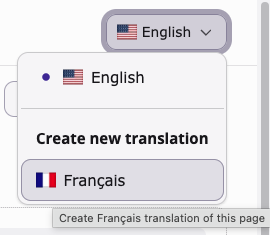

# Translate page content elements

<!-- #TYPO3v14 #Beginner #Backend #ContentElements #Editing @username -->

Translating a page does not translate what is on it. Once the page exists in a second language, its content areas start out empty: the text, images and other elements still live only in the default language. Bringing them across is a separate step, and TYPO3 asks you to make one decision while you do it — whether the translated elements stay tied to the originals, or become independent copies you can rearrange at will. That decision is easier to make before you click than to undo afterwards.

## Learning objective

In this step-by-step guide you will translate the content elements of a page into a second language, choosing between the two translation modes TYPO3 offers, and then edit the translated text.

## Prerequisites

### Tools and technology

* Backend access to a TYPO3 v14 installation
* A backend user with permission to edit content in the target language
* A site with a second language configured (see [Adding languages to a site](https://docs.typo3.org/permalink/t3coreapi:sitehandling-addinglanguages))
* A page that already has a translation in the target language, and that holds content in the default language

### Knowledge and skills

* You know how to [Log in to the TYPO3 backend](LogInToTheTypo3Backend.md)
* You know how to [Add content elements](AddContentElements.md)
* [Basic knowledge of the TYPO3 backend](https://docs.typo3.org/permalink/t3start:backend)

## Decide how the translation should behave

Before you translate anything, it helps to know what the two modes mean, because they answer different needs.

**Connected mode** keeps every translated element linked to its original. The translation follows the structure of the default language: if you later add an element to the default language, or move one, the translation is kept in step. This is what you want when both languages should say the same things in the same order — most sites, most of the time.

**Free mode** copies the elements into the target language and cuts the link. From then on the two languages are independent: you can add, remove and reorder elements in the translation without touching the original, and changes in the default language do not reach it. This is what you want when a language version genuinely needs to differ.

> [!IMPORTANT]
> Choose deliberately. Moving a page from connected to free mode later means untangling the links between the elements by hand, and a page can end up with a mixture of both if you translate it in several passes.

## Open the page in the default language

1. In the module menu, choose **Content** > **Layout**.
2. In the page tree, select the page whose content you want to translate.

   The page opens in the default language and shows its content areas. In the screenshot, the **Content area** of the page "About" holds a **Text & Images** element; the small flag on the element tells you which language it belongs to.

   

## Switch to the target language

1. Open the language selector at the top right of the Layout module.
2. Choose the language you want to translate into.

   

> [!NOTE]
> The screenshot shows the selector on a page that has **no** French translation yet, which is why Français is listed under **Create new translation**. Once the page translation exists, the language appears as an ordinary entry in the list and switching to it simply changes the view.

The Layout module now shows the same page in the target language. Its content areas are empty, because none of the elements have been translated yet.

## Translate the content elements

With the target language selected and the content area still empty, TYPO3 offers to bring the elements over from the default language.

1. Start the translation from the empty content area.
2. Choose the mode you settled on earlier:
   * **Translate** — connected mode, keeping each element linked to its original
   * **Copy** — free mode, creating independent elements
3. Select the content elements you want to bring across. You do not have to take all of them.
4. Confirm.

TYPO3 creates one element in the target language for each element you selected, carrying over the content of the original so you have something to translate rather than an empty form.

## Edit the translated content

The new elements still hold the default-language text. Replace it with the translation:

1. Click the **Edit** (pencil) icon on a translated element.
2. Replace the header and the body text with the translated wording.
3. Click **Save**, then **Close**.
4. Repeat for each translated element.

In connected mode you will find some fields locked to the original — that is the link doing its job. Fields that must stay identical across languages, such as the element type, are managed from the default language.

## Check the result

1. Use **View webpage** to open the page in the frontend.
2. Switch the frontend to the target language and confirm the translated content appears as expected.

## Summary

Congratulations! You translated the content elements of a page into a second language: you chose between connected and free mode with your eyes open, brought the elements across from the default language, and replaced their text with the translation. The page now reads properly in both languages, and you know which of the two modes will keep itself in step with the original as the site grows.

## Next steps

Now that you can translate content, you might like to:

* [Change a TYPO3 site's default language](ChangeATypo3SitesDefaultLanguage.md)
* [Add content elements](AddContentElements.md) to a page before translating it
* [Modifying the page properties](ModifyingThePageProperties.md), which are translated per language as well

## Resources

* [Adding languages to a site](https://docs.typo3.org/permalink/t3coreapi:sitehandling-addinglanguages)
* [Working with content elements in the TYPO3 Editors Tutorial](https://docs.typo3.org/permalink/t3editors:content-working)
* [Introduction to the TYPO3 backend](https://docs.typo3.org/permalink/t3start:backend)
