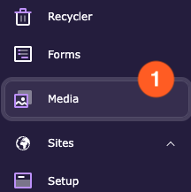
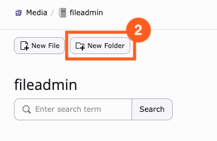
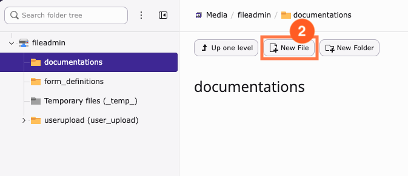
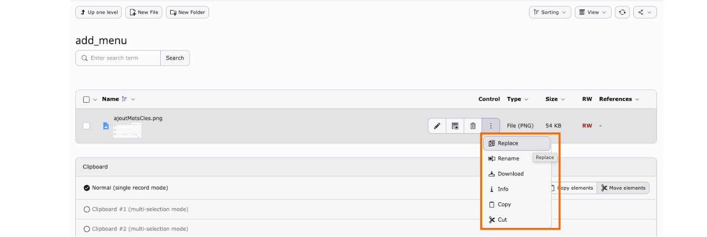
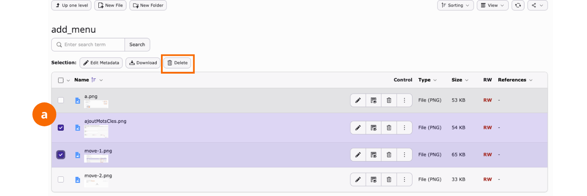
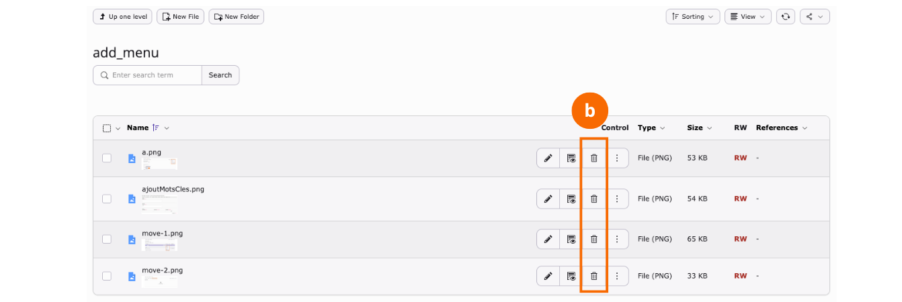

# Use the Media module

<!-- #TYPO3v14 #Beginner #Backend #Editing @delfynn2kx -->

Every image on your site has to live somewhere before you can place it on a page. That somewhere is the **Media** module: the file storage behind your TYPO3 installation, usually rooted at `fileadmin`. It works much like the file manager on your computer — folders, files, rename, move, delete — with a few things a file manager does not have, such as pulling in a YouTube video as if it were a file, and telling you whether anything on your site still points at a file before you remove it.

## Learning objective

In this step-by-step guide you will work with files and folders in the Media module: create a folder, add files to it, and then rename, replace, move and delete them.

## Prerequisites

### Tools and technology

* Backend access to a TYPO3 v14 installation
* A backend user with permission to manage files
* A file storage you may write to, such as `fileadmin`

### Knowledge and skills

* You know how to [Log in to the TYPO3 backend](LogInToTheTypo3Backend.md)
* [Basic knowledge of the TYPO3 backend](https://docs.typo3.org/permalink/t3start:backend)

## Open the Media module

1. In the module menu, choose **Media**.

   

The module opens on your file storage. The folder tree sits on the left, the contents of the selected folder fill the rest.

## Create a folder

Files are easier to find later if you group them now.

1. Select the folder you want to create the new folder inside — here, the root of `fileadmin`.
2. Click **New Folder**.

   

3. Type a name for the folder (3).
4. Click **Create folder** (4).

   

## Add files

1. Open the folder you want to put files into.
2. Click **New File**.

   

The dialog offers three different ways to add something, and it is worth knowing all three.

![The "New File" dialog for fileadmin: /documentations/. Section a, "Upload files", has a "Select & upload files" button and shows the allowed file extensions as an asterisk. Section b, "Add new media asset", has a field reading "Paste media URL here…" with an "Add media" button, and lists YOUTUBE and VIMEO as allowed media providers. Section c, "Create new textfile", has a file name field and a "Create file" button, above a list of editable text extensions including CSS, CSV, HTML, JS, JSON, MD, RST, SQL, TXT, TYPOSCRIPT, XML and YML.](Images/UseTheMediaModule/NewFileDialog.png)

* **a — Upload files.** Click **Select & upload files** and pick files from your computer. The badge underneath tells you which extensions this storage accepts.
* **b — Add new media asset.** Paste a YouTube or Vimeo URL and click **Add media**. TYPO3 stores a small reference file, so the video can then be used anywhere a file can — you never upload the video itself.
* **c — Create new textfile.** Enter a name and click **Create file** to create an empty text file you can edit in the backend. The badges list the extensions you are allowed to create.

> [!TIP]
> You can also drag files from your computer straight into an open folder. An empty folder says so: *"This folder is empty — Drag files here to upload them."*

## Rename a file

You can rename from either of the module's two view modes. Use the **View** menu at the top right to switch between **Tiles** and **List**, and to toggle thumbnails and the clipboard.

**In tiles view**, click a file's tile to open its menu and choose **Rename** (a).

**In list view**, click the three-dot button at the end of the file's row and choose **Rename** (b).

## Replace a file

Replacing keeps the file in place and swaps its contents, so anything already pointing at it keeps working. Use it when you have a newer version of the same image or document.

1. Open the three-dot menu on the file's row.
2. Choose **Replace**.

   

## Move a file

Moving works through the clipboard: cut in one folder, paste in another.

1. In the source folder, open the three-dot menu on the file's row and choose **Cut**.

   

2. Navigate to the destination folder.
3. Click **Paste in clipboard content**, which only appears once the clipboard holds something.

   

## Delete a file

There are two routes, depending on how many files you are removing.

**Several files at once** — tick the checkbox on each row, then click **Delete** in the **Selection** toolbar (a).

**A single file** — click the wastebasket icon in that file's row (b).

> [!IMPORTANT]
> Check the **References** column before you delete. It counts the places on your site that use the file. Deleting a file that is still referenced leaves broken images and links behind on those pages.

## Summary

Congratulations! You can now look after the files behind your site from the Media module: you created a folder, added files to it by upload, by media URL and as a new text file, and then renamed, replaced, moved and deleted them. Knowing that **Replace** keeps existing references intact — and that the References column warns you before a delete breaks something — is what separates tidying up from breaking pages.

## Next steps

Now that your files are organised, you might like to:

* [Add content elements](AddContentElements.md) and place your images on a page
* [Clearing the frontend cache in the TYPO3 backend](ClearingFrontendCacheInTypo3Backend.md), if a replaced image still shows the old version
* Edit the metadata of a file to give it a proper alternative text and caption

## Resources

* [Working with content elements in the TYPO3 Editors Tutorial](https://docs.typo3.org/permalink/t3editors:content-working)
* [Introduction to the TYPO3 backend](https://docs.typo3.org/permalink/t3start:backend)
