# Use the Records module in TYPO3

<!-- #TYPO3v14 #Beginner #Backend #Editing @dhubert974 -->

The **Layout** module shows a page the way an editor thinks about it: content, arranged in columns. But not everything in TYPO3 lives on a page. News articles, addresses, categories and other reusable data are stored as *records*, usually inside a folder, and a folder has no layout to speak of. That is what the **Records** module is for: it lists whatever is stored on the selected page or folder as rows in a table, and gives you the actions that go with them — create, edit, hide, delete, copy, and more.

The module was called **List** in TYPO3 v13 and earlier. The name changed in v14; the module itself does the same job.

## Learning objective

In this step-by-step guide you will find your way around the **Records** module and manage the records stored on a page or in a folder. You will:

* Explore the module header and the records list
* Create, edit, hide and delete a record
* Recognise when to use **Records** and when to use **Layout**

## Prerequisites

### Tools and technology

* Backend access to a TYPO3 v14 installation
* A backend user with editor permissions or higher
* A page or a folder that contains records

### Knowledge and skills

* You know how to [Log in to the TYPO3 backend](LogInToTheTypo3Backend.md)
* [Basic knowledge of the TYPO3 backend](https://docs.typo3.org/permalink/t3start:backend)

> [!NOTE]
> The screenshots in this guide show a folder holding News records. **News** is not part of the TYPO3 core — it comes from an extension. Which record types you can create depends on the extensions installed in your installation, so your own lists will look different.

## Open the Records module

1. In the module menu, choose **Content** > **Records**.

   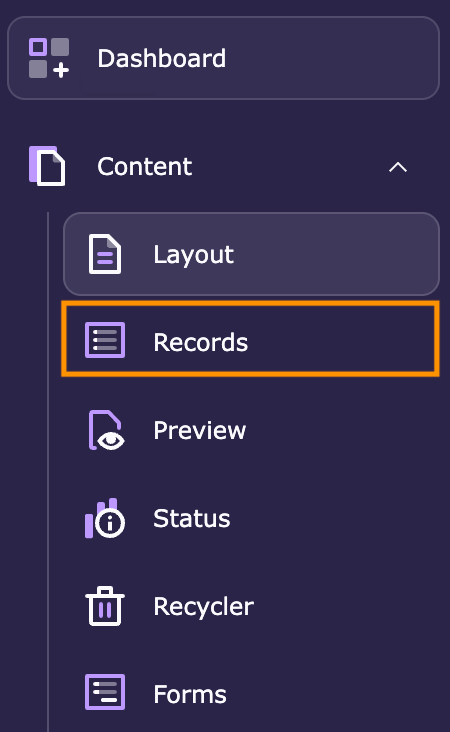

2. In the page tree, select the page or folder whose records you want to see.

   The module lists everything stored there, grouped by record type.

## Explore the module header

The header holds the actions that apply to the whole page or folder.

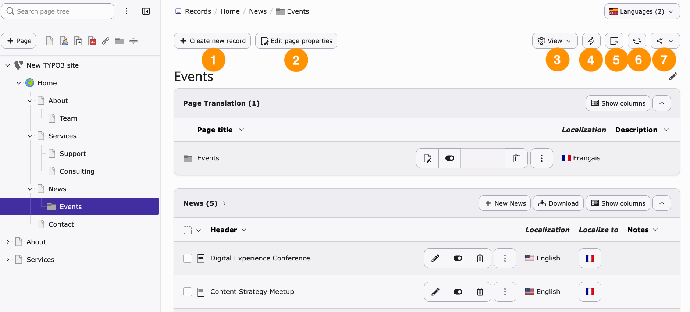

1. **Create new record** — add a record to the selected page or folder.
2. **Edit page properties** — open the properties of the page or folder itself.
3. **View** — show or hide the search field and the clipboard.

   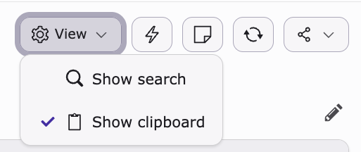

4. **Clear cache** — clear the cache of the current page.
5. **Notes** — create an internal note for your team.
6. **Reload** — refresh the module.
7. **Share** — bookmark the page or copy its URL.

   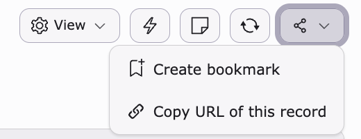

On a multilingual site, a **Languages** selector appears at the top right. Use it to choose which languages the list shows.

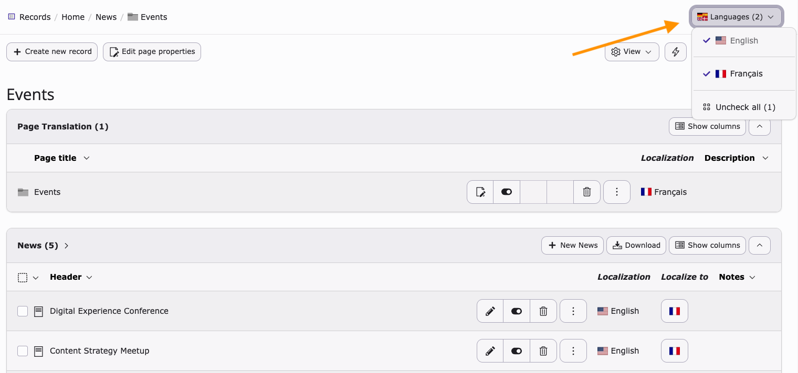

## Explore the records list

Below the header, each record type gets its own section.

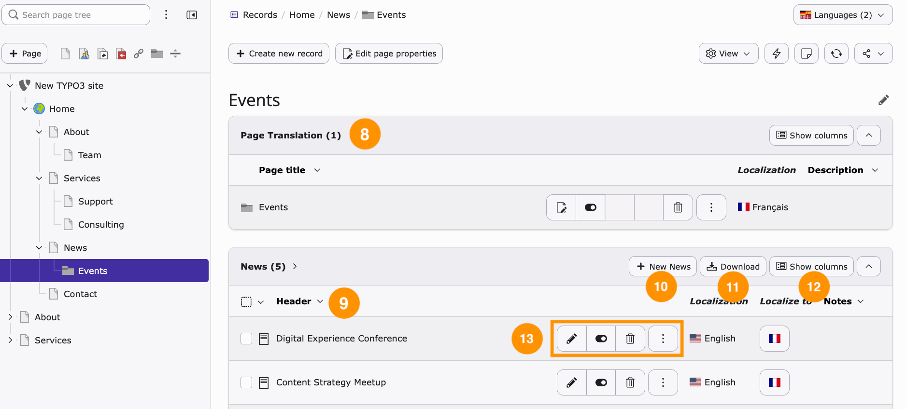

8. **Page Translation** — on a multilingual site, the translations of the page or folder are listed first.
9. **The records list** — the records stored here. If you selected a page rather than a folder, this is the list of its content elements.
10. **New record** — create another record of this type. In the screenshot the button reads **New News**, because the section lists News records.
11. **Download** — open a dialog with export options and download the records as **CSV** or **JSON**.

    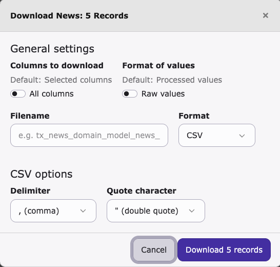

12. **Show columns** — choose which fields the table shows, such as keywords, description or publish date. Additional columns can be edited inline, which is the quickest way to change one field on many records at once.

    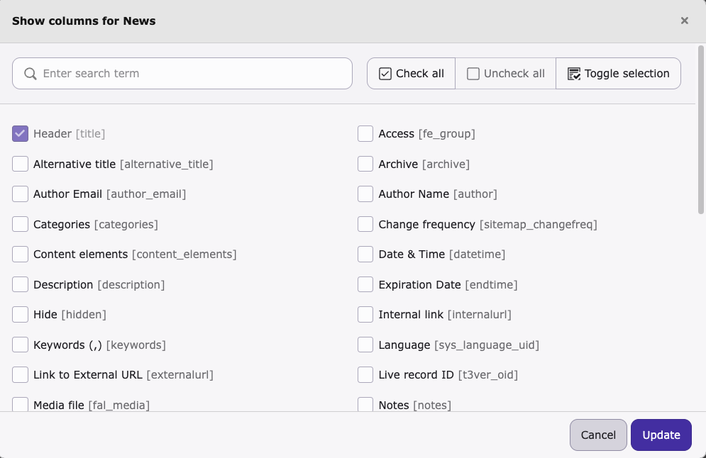

13. **Record actions** — edit, hide and delete the record. The three-dot button opens more options: **Info**, **History/Undo**, **New record**, **Copy** and **Cut**.

    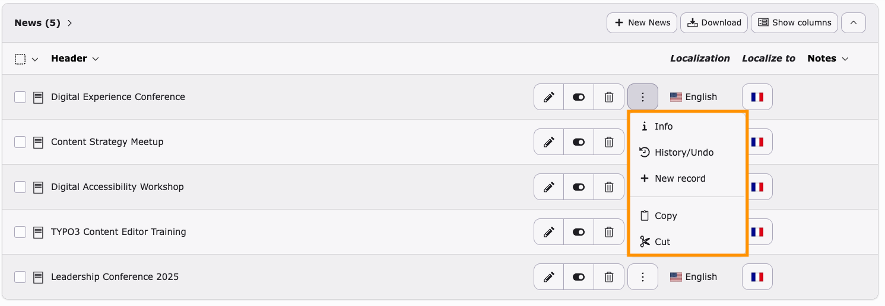

## Create and manage records

All the everyday actions are available directly from the list.

### Create a record

1. In the page tree, select the page or folder that should hold the record.
2. Click **Create new record**.

   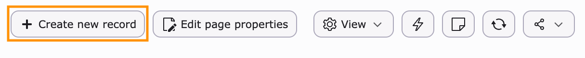

3. Choose the record type you want to create. The available types depend on the extensions installed in your TYPO3 installation.
4. Fill in the required fields.
5. Click **Save**.

The new record appears in the list, in the section for its type.

### Edit a record

1. Find the record in the list.
2. Click the **Edit** icon.

   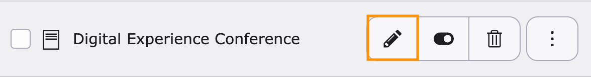

3. Change the values you want to update.
4. Click **Save**.

### Hide or unhide a record

Hiding takes a record offline without deleting it — useful while you prepare something, or when content should come back later.

1. Find the record in the list.
2. Click the **Hide**/**Unhide** icon.

   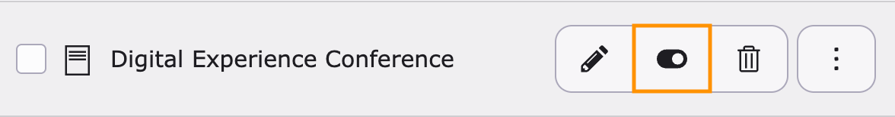

A hidden record stays in TYPO3 and remains visible to editors in the backend, but visitors no longer see it.

### Delete a record

1. Find the record in the list.
2. Click the **Delete** icon.

   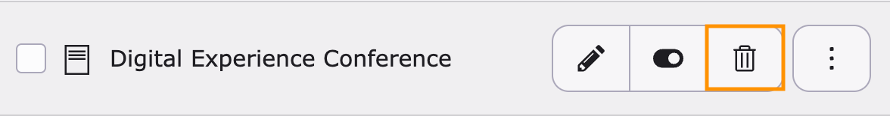

3. Confirm the deletion.

> [!TIP]
> Deleted a record by mistake? Use the **Recycler** module to restore it.

## Records or Layout: which module should you use?

Both modules can work with the content of a page, but they answer different questions.

* Use **Layout** to edit page content visually — you see the columns and the elements in the order visitors get them.
* Use **Records** to manage records: folder-based data such as news or addresses, bulk actions, inline editing of many fields at once, exports, and the advanced options behind the three-dot menu.

## Summary

Congratulations! You can now use the **Records** module: you know your way around the module header and the records list, and you can create, edit, hide and delete records. You also know when a job belongs in **Records** rather than in **Layout**.

## Next steps

Now that you can manage records, you might like to:

* [Add content elements](AddContentElements.md) to edit page content visually in the **Layout** module
* [Modifying the page properties](ModifyingThePageProperties.md), which is what the **Edit page properties** button opens
* [Change a TYPO3 site's default language](ChangeATypo3SitesDefaultLanguage.md) to work with the **Languages** selector

## Resources

* [The Records module in the TYPO3 Getting Started Tutorial](https://docs.typo3.org/m/typo3/tutorial-getting-started/main/en-us/Concepts/Backend/RecordsModule/Index.html)
* [Using the Records module effectively in the TYPO3 Editors Tutorial](https://docs.typo3.org/m/typo3/tutorial-editors/main/en-us/RecordModule/UsingEffectively/Index.html)
* [Introduction to the TYPO3 backend](https://docs.typo3.org/permalink/t3start:backend)
