# Use the TYPO3 Dashboard

<!-- #TYPO3v13 #Beginner #Backend #Editing @dhubert974 -->

Every editor works differently. One person needs to see what changed on the site since yesterday; another wants the pages that are still missing a meta description; a third just wants a news feed and their bookmarks in one place. The **Dashboard** is where each of you decides what "the important stuff" means: it is a personal, freely arranged collection of widgets, and it is the first thing you see when you log in to the TYPO3 backend.

Because a dashboard belongs to your backend user, nobody else sees your layout, and you can keep several dashboards side by side — one per project, one per task, one for whatever else you need.

## Learning objective

In this step-by-step guide you will set up the TYPO3 Dashboard to suit the way you work. You will:

* Find your way around the Dashboard interface
* Create a second dashboard and switch between dashboards
* Add, configure, move and remove widgets

## Prerequisites

### Tools and technology

* Backend access to a TYPO3 v13 installation
* A backend user with editor permissions or higher

### Knowledge and skills

* You know how to [Log in to the TYPO3 backend](LogInToTheTypo3Backend.md)
* [Basic knowledge of the TYPO3 backend](https://docs.typo3.org/permalink/t3start:backend)

## Open the Dashboard

The Dashboard is the default starting point when you log in to the TYPO3 backend. If it does not open automatically, you can reach it at any time:

1. In the module menu, choose **Dashboard**.

   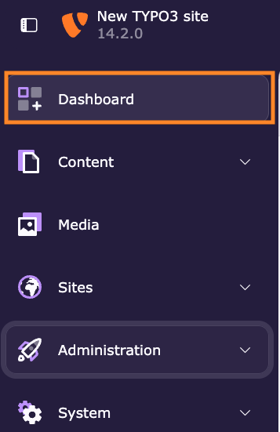

## Explore the Dashboard interface

The Dashboard is made up of a tab bar for your dashboards and a canvas holding the widgets of the selected one.

1. **Add a new dashboard** — create another dashboard alongside the current one.
2. **Edit the current dashboard** — change its title.
3. **Delete the current dashboard.**
4. **Manage a widget** — the icons in a widget's header let you configure, reload, move and remove it.
5. **Add a widget** to the dashboard you are looking at.

## Add a dashboard

1. Click the **+** button next to the dashboard tabs.
2. In the **Add dashboard** dialog:
   1. Enter a **Title of dashboard** (1).
   2. Choose a preset (2). **Empty dashboard** creates a dashboard with no widgets on it, so you can build it up yourself.
   3. Click **Add Dashboard** (3).

   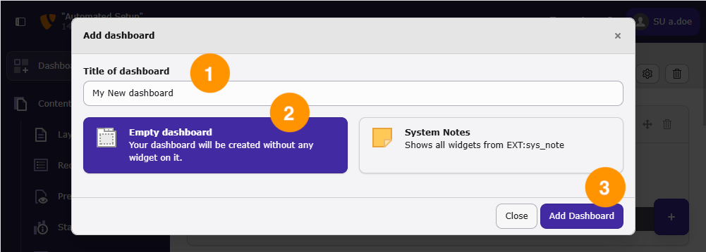

The new dashboard opens as an additional tab. Click a tab to switch between your dashboards.

## Add widgets to a dashboard

Widgets are what make a dashboard useful: they show news, records, system data or anything else an extension provides.

1. On an empty dashboard, click **Add a widget** in the middle of the canvas.

   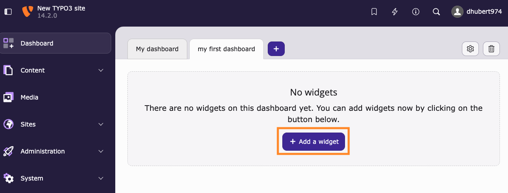

   Once the dashboard holds at least one widget, use the round **+** button at the bottom right instead.

   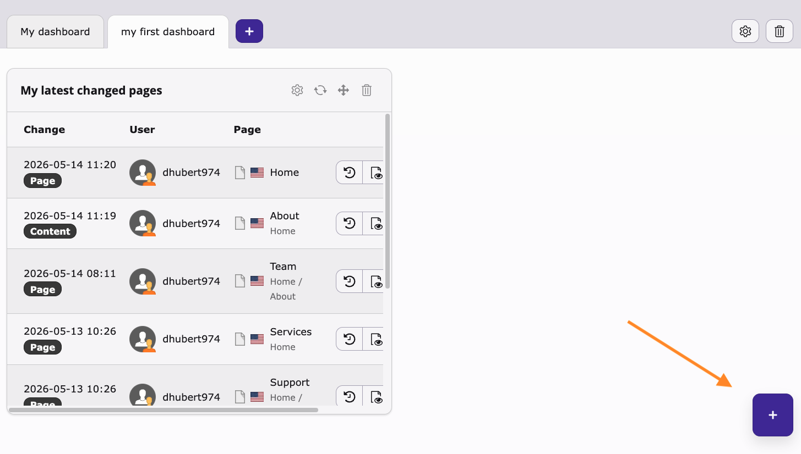

2. The widget wizard opens and lists the available widgets, grouped into categories such as **Recently used**, **General**, **System Information** and **News**.
3. Browse the categories or type in the search field to narrow the list.
4. Click a widget to add it.

   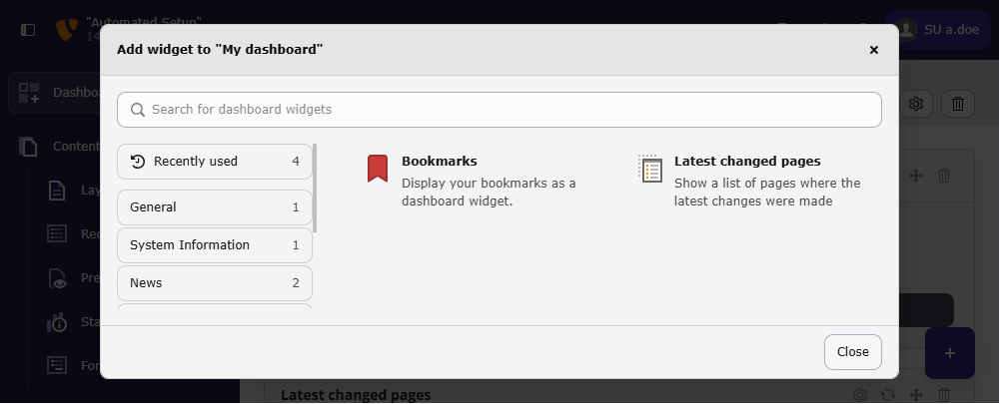

The widget appears on your dashboard.

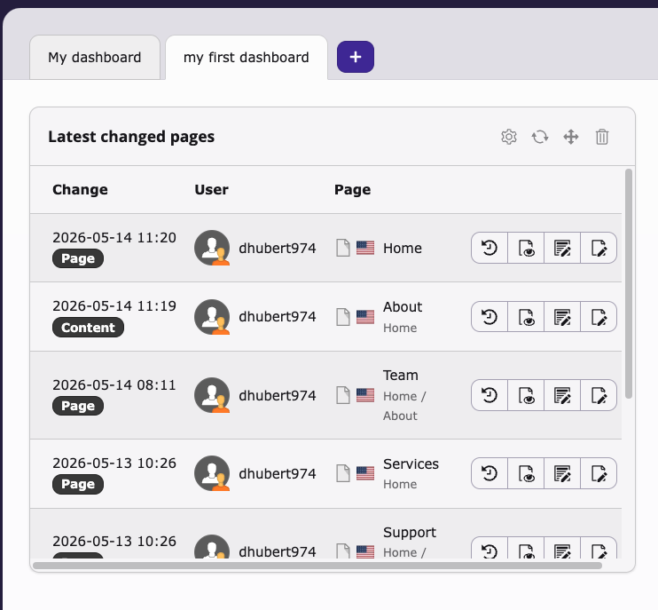

> [!NOTE]
> Which widgets you can choose from depends on the extensions installed in your TYPO3 installation. The **News** category in the screenshots, for example, comes from an extension and will not appear in a plain installation.

## Manage widgets

Every widget carries its own set of icons in the header: **settings**, **reload**, **move** and **remove**.

### Configure a widget

Some widgets can be customised, and a few need to be configured before they show anything at all.

1. Click the **settings** icon (the gear) in the widget header.

   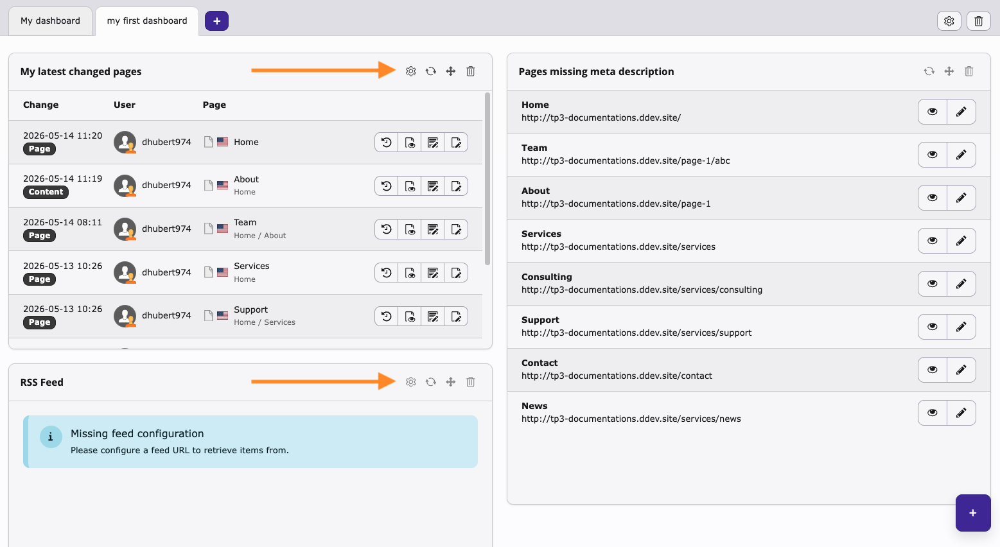

2. The **Widget Settings** dialog opens.

   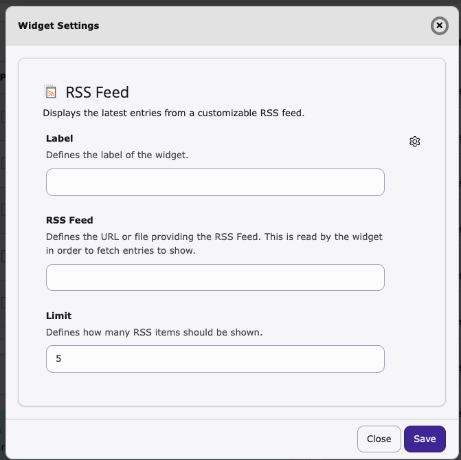

3. Adjust the available options. For the RSS Feed widget in the screenshot, that means giving the widget a **Label** of your own, entering the feed URL under **RSS Feed**, and setting a **Limit** for how many entries to show.
4. Click **Save**.

The widget reloads and shows your personalised content.

### Move a widget

Rearrange widgets so the ones you look at most sit where you look first.

1. Click and hold the **move** icon (the four-way arrow) in the widget header.

   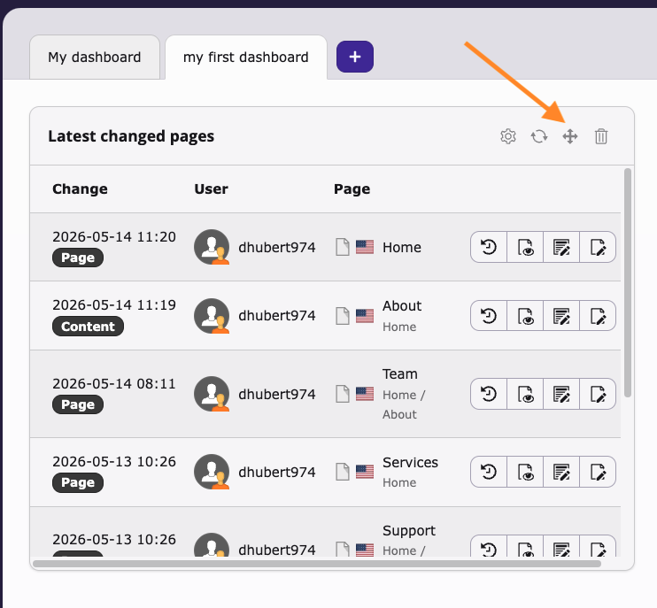

2. Drag the widget to its new position.
3. Release to drop it.

The dashboard keeps the new arrangement.

### Remove a widget

1. Click the **wastebasket** icon in the widget header.

   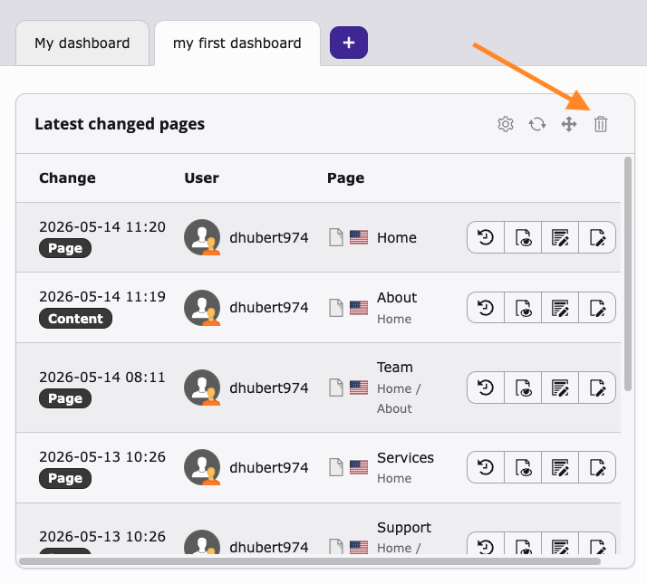

2. Confirm with **Remove** in the dialog that appears.

   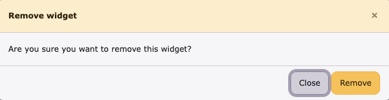

The widget disappears from the dashboard. You can add it back at any time from the widget wizard.

## Summary

Congratulations! You can now make the TYPO3 Dashboard your own: you know your way around the interface, you can create several dashboards and switch between them, and you can add, configure, move and remove widgets. Because the dashboard belongs to your backend user, the layout you build is yours alone — a starting point that shows you what matters the moment you log in.

## Next steps

Now that your dashboard is set up, you might like to:

* [Add content elements](AddContentElements.md), whose changes then turn up in your "Latest changed pages" widget
* [Modifying the page properties](ModifyingThePageProperties.md) to fill in the meta descriptions that the SEO widgets report as missing
* [Create a page with drag and drop](CreateAPageWithDragAndDrop.md)

## Resources

* [The Dashboard in the TYPO3 documentation](https://docs.typo3.org/c/typo3/cms-dashboard/main/en-us/Editor/Index.html)
* [Introduction to the TYPO3 backend](https://docs.typo3.org/permalink/t3start:backend)
