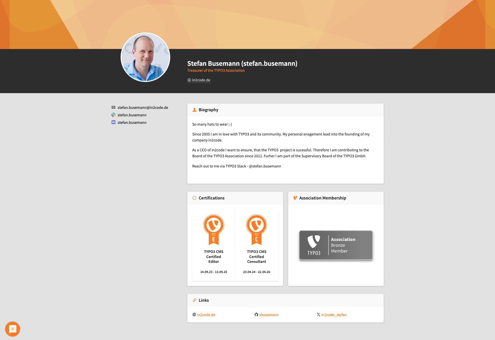
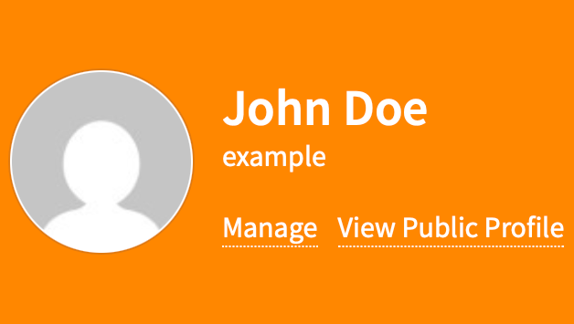
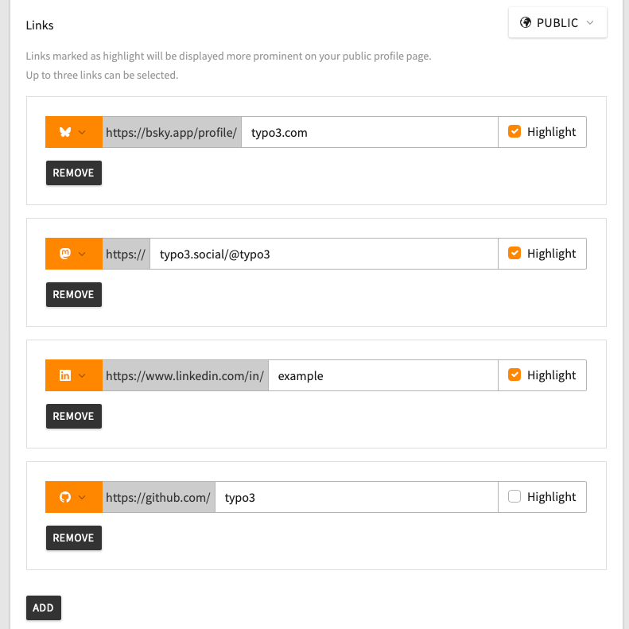
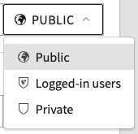
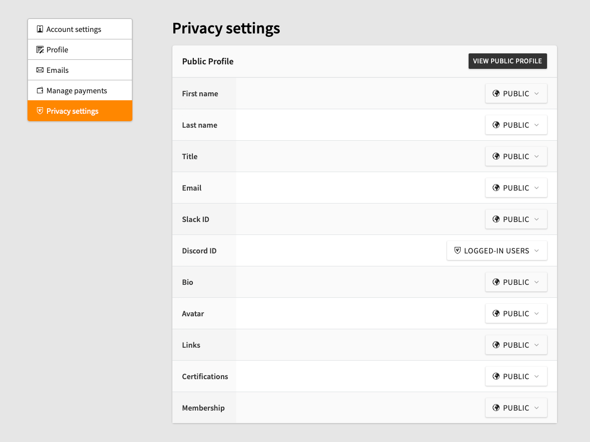

# Edit Your Public My TYPO3 Profile

<!-- #Beginner @mabolek -->

Public My TYPO3 profiles are an opportunity to showcase who you are and what you do to the rest of the TYPO3 community and beyond. Your personal profile page allows you to showcase your bio, contact information, and achievements — everything protected by fine-grained privacy settings.

## Learning objective

In this step-by-step guide you will edit your profile information and change the visibility (privacy) settings for your information.

Here's an example of [a real public profile](https://my.typo3.org/u/stefan.busemann), to show you how your profile could look:

## Prerequisites

### Tools and technology

* A computer with a web browser and an internet connection
* A My TYPO3 account. See how to [Sign Up for a My TYPO3 Account](SignUpForAMyTypo3Account.md)

### Knowledge and skills

* How to use a web browser

## Watch the video

[Watch this YouTube video](https://www.youtube.com/watch?v=oOqLihcwmDg) to follow along with the steps below.

## Navigate to the edit profile page

In order to edit your profile, you must firs log in to your My TYPO3 account and find your way to the edit profile page.

1. In your web browser, navigate to [my.typo3.org/login](http://my.typo3.org/login). If you are already logged in, you can continue from step 4.
2. Enter your username and password in the appropriate fields.
3. Click the *Log in* button. You will be forwarded to your *internal* user profile page.

4. In the large orange area, just below your name, click on the *Manage* link. You will be directed to your profile settings page.
5. In the navigation menu to the left, click on *Profile*. You will now see your edit profile page.

## Edit your profile

The edit profile page shows you information about your profile image (avatar), as well as editing fields for your profile information.

> [!NOTE]
> Your profile image is connected to your email address and is provided by Gravatar. To upload an image, you'll have to  [set up a Gravatar account](https://gravatar.com/connect).

1. Fill in the information you like in the appropriate fields.
2. Towards the bottom of the page, click the black *Add* button to create links that can be listed on your profile. Each link has three elements:
   * An orange drop-down menu for selecting the type of link. Example: *Facebook* or *Bluesky*.
   * A field for the URL or username you would like to link to, depending on your selection in the drop-down menu.
   * A checkbox to highlight the link. Checking it will display the link at the top of your profile.

3. Click the orange *Save* button at the bottom of the page to save your changes.

## Configuring the visibility of your information

Your profile information may still not be visible on your public profile page. This is because your profile information is hidden by default, so you must update its visibility settings.

To the right of almost every field is a drop-down menu where you can choose the visibility of that field's information. Here's an example of how it looks:

1. For each field, use the drop-down menu to select the visibility setting you would like. The visibility setting is updated automatically, so there is no need to click the *Save* button.

> [!NOTE]
> Apart from your username (which is always visible) fields that do not have a visibility option next to them will always be hidden from everyone.

## Access more privacy and visibility settings

You can configure the visibility of even more information on the *Privacy settings* page.

1. In the navigation menu to the left of the form, click on *Privacy settings*. You will be taken to a *Privacy settings* page looking something like this:

2. For each entry, use the drop-down menu on the right to select the visibility setting you would like. The visibility setting is updated automatically, so there is no need to click the *Save* button.

## Check your profile

It is now time to check how your profile is looking. As the fields that are visible may change whether you are logged in or not, it is also good to look at the profile in your browser's *incognito mode* or *private browsing*.

1. Click the black *View public profile* button to see your public profile as it looks now.
2. Copy the URL of the page.
3. Open a new *incognito mode* or *private browsing* window. In this window you are no longer logged in.
4. Paste in the URL of your profile page in the address bar.
5. Hit enter to visit the URL. You can now see your profile as others see it, if they are not logged in.

If you are missing some information, you can go back to the *Privacy settings* page and set more fields to *Public*.

> [!TIP]
> The URL to a user profile is always `my.typo3.org/u/<username>`, where `<username>` is the user's username (e.g. `john.doe`).

## Summary

Congratulations! You have now edited your public My TYPO3 profile and changed the visibility settings for the fields.

## Next steps

Now that you have edited your public My TYPO3 profile, you might like to:

* Ask a colleague for their My TYPO3 username and visit their profile at `my.typo3.org/u/<username>`.

## Resources

* [Set up a Gravatar account](https://gravatar.com/connect)
* [Read more about Avatars on Gravatar's support page](https://support.gravatar.com/avatars/)
