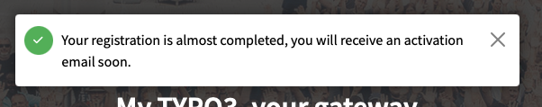
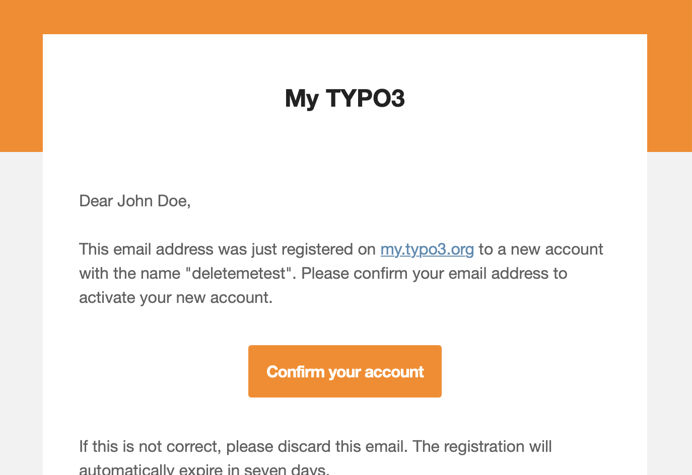

# Sign Up for a My TYPO3 Account

<!-- #Beginner @mabolek -->

By registering for My TYPO3, you create one centralized account for all your activities in the TYPO3 ecosystem. Among other things, you can use ut to create a Slack account, book online certifications, attend training courses, and contribute code.

## Learning objective

In this step-by-step guide you will sign up for your own My TYPO3 account.

## Prerequisites

### Tools and technology

* A computer with a web browser and an internet connection
* An email address

### Knowledge and skills

* How to use a web browser

## Registration form

1. Visit [my.typo3.org/register](https://my.typo3.org/register) to start the process.
2. Fill in the registration form. Take care to read the instructions below each field.

> [!TIP]
> Choose your username wisely. Even if it is allowed, we recommend that you do not use special characters like `@` in your username. Keep to alphanumeric characters (the letters a–z and numbers 0–9). It could save you from annoying problems down the road.

4. Check the *I have read and accept the privacy policy* checkbox if it is OK for you.
5. Click the orange *Register* button. If you have errors in the form, you will be told so. Otherwise, you will be directed to the my.typo3.org home page. It will display this confirmation message:

## Confirm your email adress

During the registration process, you will need to confirm your email address.

1. Check your email. You should have received an email with the subject "Confirm your registration on my.typo3.org."
2. Open the email. It should look similar to the screenshot below:

3. Click the orange *Confirm your account* button. You will be directed to the my.typo3.org website, where a message will tell you that your email has been confirmed.

You should now be able to log in with your new account at [my.typo3.org/login](https://my.typo3.org/login).

> [!IMPORTANT]
> **Extra steps may be necessary.** In some cases, an extra confirmation step may be necessary. If so, you will receive an email with further instructions.

## Summary

Congratulations! You have now registered your My TYPO3 account.

## Next steps

Now that you have completed the registration process, you might like to:

* [Sign Up for a TYPO3 Slack Account](SignUpForATypo3SlackAccount.md)
* [Edit Your Public My TYPO3 Profile](EditYourPublicMyTypo3Profile.md)

## Resources

* [Frequently asked questions about your My TYPO3 profile])(https://my.typo3.org/faq/category/profile)
