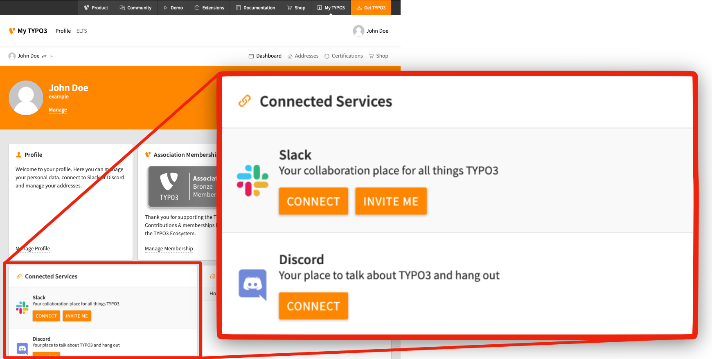

# Sign Up for a TYPO3 Slack Account

<!-- #Beginner @mabolek -->

Slack is an instant messaging and team collaboration tool. It is our main channel for communication in the TYPO3 community. This guide explains how to get access to TYPO3’s Slack workspace through your new or existing my.typo3.org user profile.

## Learning objective

In this step-by-step guide you will sign up for a TYPO3 Slack account.

## Prerequisites

### Tools and technology

* A computer with a web browser and an internet connection

### Knowledge and skills

* How to use a web browser
* A My TYPO3 account. See how to [Sign Up for a My TYPO3 Account](SignUpForAMyTypo3Account.md)

## Request a Slack invite

1. Log in to your My TYPO3 account at [my.typo3.org/login] (https://my.typo3.org/login>). After logging in, you will be directed to your profile page.
2. On your profile page, look for the Connected Services section.
3. Click on the *Invite Me* button. An email with an invitation link will be sent to your email.

> [!NOTE]
> If you already have a user in TYPO3 Slack, you can connect it to your my.typo3.org account by clicking the Connect button.

## Confirm invitation mail

1. Open your email client and look for the invitation email.
2. In the email, click on the *Join Now* link. A Slack user account setup page will open in your web browser.
3. When prompted, enter your desired password for the TYPO3 Slack workspace.
4. Complete your Slack profile setup.

> [!NOTE]
> For technical reasons, your my.typo3.org account does not allow you to gain access to Slack directly. That’s why you are asked to set up a Slack user account and supply a password for it. Your Slack login credentials are therefore not the same as the ones you use for your My TYPO3 account.

## Summary

You can now access TYPO3 Slack and chat with the community at [typo3.slack.com](https://typo3.slack.com)

## Next steps

Now that you have your Slack account up and running, you might like to:

* [Learn more about how to use Slack](https://slack.com/help/articles/218080037-Getting-started-for-new-Slack-users)

## Resources

* [Slack help center](https://slack.com/help/categories/360000049043)
* [Download the Slack app](https://slack.com/downloads)
