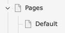
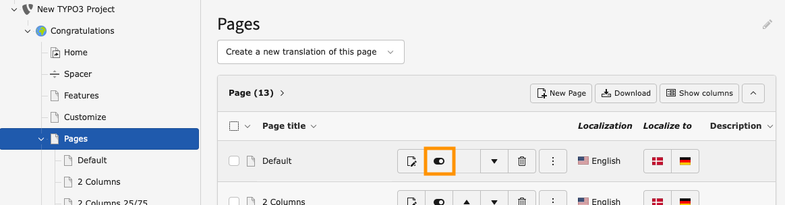
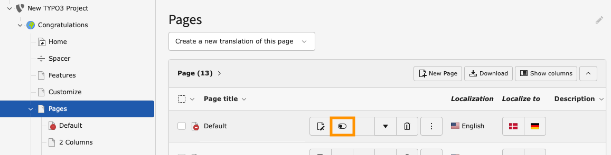

# Enabling and disabling a page in the List Module

<!-- #TYPO3v13 #Beginner #Backend #Editing #ListModule @mabolek -->

TYPO3 allows you to disable pages. Disabled pages are inaccessible to frontend website visitors, but you can still edit the pages in the backend. Depending on your TYPO3 configuration all pages that you create may be disabled by default. They will need to be enabled in order to be published on your website.

*In the above screenshot of TYPO3's page tree the "Features" page is disabled, indicated by the overlaid red-and-white "no entry" sign on the page's icon. The "Customize" page is enabled and has a normal page icon.*

## Learning objective

In this step-by-step guide you will disable and enable a page using the visibility toggle in the list of pages in TYPO3's List Module.

## Prerequisites

### Tools and technology

* Backend access to a TYPO3 installation

### Knowledge and skills

* [How to log into the TYPO3 Backend](https://docs.typo3.org/permalink/t3start:backend-login)
* [Basic knowledge of the TYPO3 backend](https://docs.typo3.org/permalink/t3start:backend)

## Disable a page

In this step, we will disable a page by using the visibility toggle in the list of pages in TYPO3's List Module.

1. In the module menu, choose the "List" module.
2. In the page tree, choose a page that you would like to disable. The page must not be disabled already.
3. In the page tree, click on the name of the page's *parent* page. A list of pages and other resources belonging to the page will appear in the Content area to the right of the Module Menu and Page Tree. (If you wonder: In the screenshot below, "Pages" is the parent page of "Default".)

4. In the list of pages, find the page you would like to disable.

5. Locate and click the disable (hide) toggle button for the page you would like to hide. In the screenshot above, the toggle button for the page "Default" is outlined in orange.

In the page tree, the disabled page will now have a red-and-white "no entry" sign on the page's icon, as shown in the screenshot at the top of this page.

## Enable a page

In this step, we will enable the disabled page again.

1. In the module menu, choose the "List" module.
3. In the page tree, click on the name of the disabled page's *parent* page. If you're progressing straight from disabling the page, it's probably still selected. A list of pages and other resources belonging to the page will appear in the Content area to the right of the Module Menu and Page Tree. (If you wonder: In the screenshot below, "Pages" is the parent page of "Default".)

4. In the list of pages, find the page you would like to disable.

5. Locate and click the enable (un-hide) toggle button for the page you would like to hide. In the screenshot above, the toggle button for the page "Default" is outlined in orange.

In the page tree, the disabled page will now have a normal page icon, like the one shown in the screenshot at the top of this page.

## Summary

You have now disabled and re-enabled a page using TYPO3's List Module.

## Next steps

A page tree can also be enabled and disabled in other ways than this:

* [Enabling and disabling a page in the page properties](EnablingAndDisablingAPageInThePageProperties.md)
* [Enabling and disabling a page in the page tree](EnablingAndDisablingAPageInThePageTree.md)

## Resources

* [Enabling and disabling a page in the page properties](EnablingAndDisablingAPageInThePageProperties.md)
* [Enabling and disabling a page in the page tree](EnablingAndDisablingAPageInThePageTree.md)
* [Introduction to the TYPO3 Backend](https://docs.typo3.org/permalink/t3start:backend)
