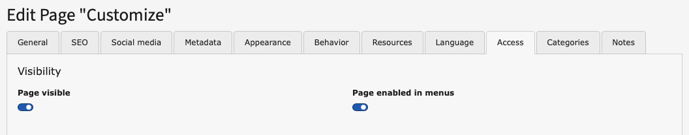
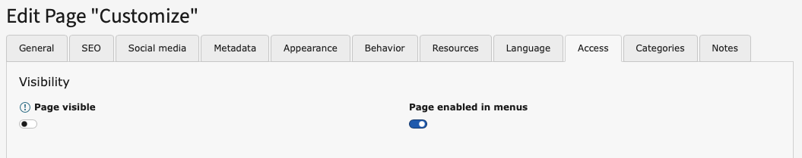

# Enabling and disabling a page in the page properties

 **Tested in:** [TYPO3v13](/Tags/TYPO3v13.md) **Categories:** [Beginner](/Tags/Beginner.md) [Backend](/Tags/Backend.md) [Editing](/Tags/Editing.md) [PageProperties](/Tags/PageProperties.md) **Author:** [@mabolek](https://my.typo3.org/u/mabolek)

TYPO3 allows you to disable pages. Disabled pages are inaccessible to frontend website visitors, but you can still edit the pages in the backend. Depending on your TYPO3 configuration all pages that you create may be disabled by default. They will need to be enabled in order to be published on your website.

*In the above screenshot of TYPO3's page tree the "Features" page is disabled, indicated by the overlaid red-and-white "no entry" sign on the page's icon. The "Customize" page is enabled and has a normal page icon.*

## Learning objective

In this step-by-step guide you will disable and enable a page through the page properties interface.

## Prerequisites

### Tools and technology

* Backend access to a TYPO3 installation

### Knowledge and skills

* [How to log into the TYPO3 Backend](https://docs.typo3.org/permalink/t3start:backend-login)
* [Basic knowledge of the TYPO3 backend](https://docs.typo3.org/permalink/t3start:backend)
* [Modifying the page properties](ModifyingThePageProperties.md)

## Disable a page

In this step, we will disable a page by setting the page's visibility toggle to *disabled*.

1. In the page tree, choose a page that you would like to disable.
2. Access the page's page properties as described in [Modifying the page properties](ModifyingThePageProperties.md)
3. In the page properties interface, choose the "Access" tab.

4. In the "Visibility" section, click the "Page visible" toggle to change it to *disabled* (off).

5. Click the "Save" button.

The page tree will update and the page will now have a red-and-white "no entry" sign on the page's icon, as shown in the screenshot at the top of the page.

## Enable a page

In this step, we will enable a page by setting the page's visibility toggle to *enabled*.

1. In the page tree, find the page you disabled previously.
2. Access the page's page properties as described in [Modifying the page properties](ModifyingThePageProperties.md)
3. In the page properties interface, choose the "Access" tab.

4. In the "Visibility" section, click the "Page visible" toggle to change it to *enabled* (on).

5. Click the "Save" button.

The page tree will update and the page will now have a normal page icon without the red-and-white "no entry" sign on the page's icon, as shown in the screenshot at the top of the page.

## Summary

You have now disabled and re-enabled a page using TYPO3's page properties interface.

## Next steps

A page tree can also be enabled and disabled in other ways than this:

* [Enabling and disabling a page in the page tree](EnablingAndDisablingAPageInThePageTree.md)
* [Enabling and disabling a page in the List module](EnablingAndDisablingAPageInTheListModule.md)

## Resources

* [Enabling and disabling a page in the page tree](EnablingAndDisablingAPageInThePageTree.md)
* [Enabling and disabling a page in the List module](EnablingAndDisablingAPageInTheListModule.md)
* [Introduction to the TYPO3 Backend](https://docs.typo3.org/permalink/t3start:backend)
