# Contributing a Step-by-Step Guide Using Your Browser and GitHub

<!-- #Beginner @mathias -->

It's easy to add a new guide to the TYPO3 Step-by-Step Guides. All of the guides are written in plain text using simple formatting instructions called Markdown. You can add a new guide using only your web browser and the tools available on the GitHub website, where the guide files are stored.

## Learning objective

In this step-by-step guide you will create a new Step-by-Step guide and create a *pull request*, asking for your guide to be included in the TYPO3 Step-by-Step guides.

Here is the approach we'll take:

- Create a GitHub account
- Copy content from the template
- Create a new file
- Create a fork
- Commit your changes
- Open a pull request

## Prerequisites

### Tools and technology

* A computer with a web browser and an internet connection

### Knowledge and skills

* How to use a web browser
* How to edit files and make screenshots on the computer you are using
* Basic understanding of Markdown, as explained in the [Markdown Cheat Sheet](https://docs.typo3.org/permalink/h2document:md-cheat-sheet)
* How to use the step-by-step guide template, as explained in [Using the Template](30UsingTheTemplate.md).

## Create a GitHub user account

> [!NOTE]
> You can skip this section if you already have a user account on GitHub.
> Continue to the *Create a new file* section below.

The TYPO3 Step-by-Step guide files are stored online, at a website called GitHub. This is a place where people upload and collaborate on collections of files and folders relating to their file-based projects.

To edit files at GitHub, you need to create a user account there. Let's create one.

1. In your browser, visit [Creating an account on GitHub](https://docs.github.com/en/get-started/start-your-journey/creating-an-account-on-github) in the GitHub Documentation.
2. Read the information on the page.
3. Follow the 4 steps in the *Signing up for a new personal account* section.

You now have a user account on GitHub. At the end of the sign-up process, you should be logged in as a user. You must always be logged in on GitHub in order to edit and contribute to files in repositories and projects there.

## Copy content from the template

All step-by-step guides should be based on the template file. It includes important instructions and makes the job of writing the guide easier. You need to copy it so it can be the starting point for your new guide.

1. Visit the step-by-step guide template in your web browser by clicking this link: [github.com/TYPO3-Documentation/TYPO3CMS-Guide-StepByStep/blob/contrib/Documentation/90Contribute/10Template/Index.md](https://github.com/TYPO3-Documentation/TYPO3CMS-Guide-StepByStep/blob/contrib/Documentation/90Contribute/10Template/Index.md)
2. When the page has loaded, click the "Copy raw file" button. The button has no text, but an icon with two partially overlapping squares. In the screenshot below, it is highlighted with an orange frame and there is an orange arrow pointing to it.

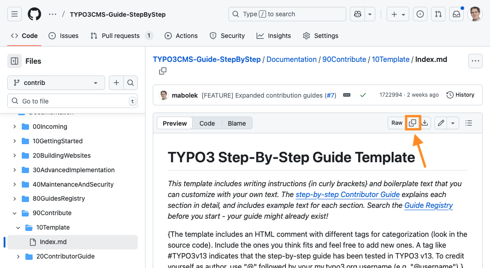

You have now copied the raw Markdown code of the template, and you're ready to paste it into a new file.

## Create a new file

We'll create a file for our new step-by-step guide. Unless you know where in the structure your guide belongs, new guides should be placed in a dedicated folder for new (or incoming) guides.

1. In your web browser, go to the Step-by-Step guides repository at [github.com/TYPO3-Documentation/TYPO3CMS-Guide-StepByStep](https://github.com/TYPO3-Documentation/TYPO3CMS-Guide-StepByStep). It will look a bit like in the screenshot below.

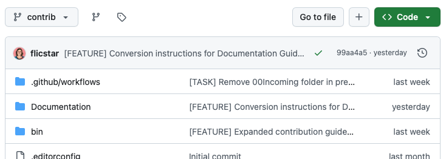

2. In the list of files and folders, click on "Documentation". This will load a new list of files and folders.
3. In the list of files and folders, click on the folder called "00Incoming". This will load a similar list, showing the filed and folders contained within that folder. This is where new guides are created. It will look a bit like in the screenshot below, but the exact files might change.

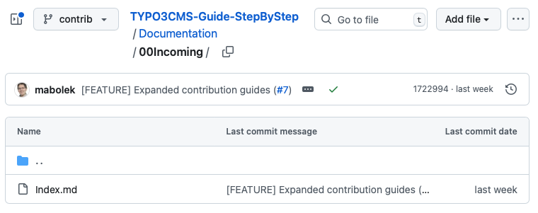

4. Click on the "Add file" button. A drop-down menu will appear.

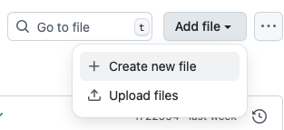

> [!NOTE]
> Depending on the size of your browser window, the "Add file" button may be hidden inside the button with three dots "···" that you can also see in the screenshot above. If so, click that button first, and you will see the "Add file" option.

5. Select "Create new file" from the drop-down menu. You'll see a warning page similar to the screenshot below, saying "You need to fork this repository to propose changes."

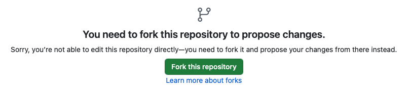

## Create a fork

Each collection of files and folders is called a *repository*. In order to edit files in a repository, you must first make your own copy of it. Such a copy is called a *fork*. It's not referring to the cutlery item, but it's rather a reference to a fork in the road. When you make changes to the repository, it diverges from the original. (Don't worry, later on we'll *merge* the two together again.)

1. Click the green "Fork this repository" button. This will start a forking process that may take a few seconds. Once the process is finished, you will see something like the screenshot below:

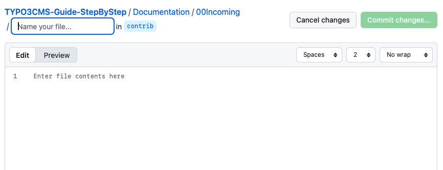

> [!NOTE]
> Don't worry, if GitHub displays a message like this one. This is just as expected.
> 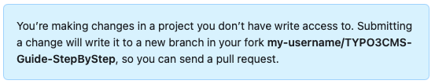

2. Where it says "Enter file contents here" is a text editor. Paste in the step-by-step guide template that you copied previously.
3. Enter a name for your file in the text box where it says "Name your file…". The [Using the Template](30UsingTheTemplate.md) guide explains exactly what your file name should be, how it should be formatted, and that it must end in ".md".

When you are finished, it should look something like in this screenshot:

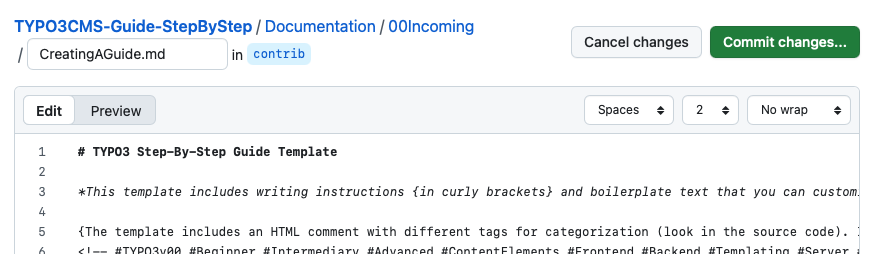
## Write the guide

Here is the point in the process when you write the step-by-step guide. See [Using the Template] 30UsingTheTemplate.md) for help to write each section of the guide. 

## Commit your changes

Committing your changes means the same as saving them, but you also add a message saying what changes your save action includes.

> [!TIP]
> You don't have to wait until you've finished writing the guide to do one big commit. You can do lots of small commits to save as you go. You are working in your fork of the repository, so nobody knows about your work yet but you. 

1. Click the green "Commit changes…" button. A dialog titled "Propose Changes" will appear.

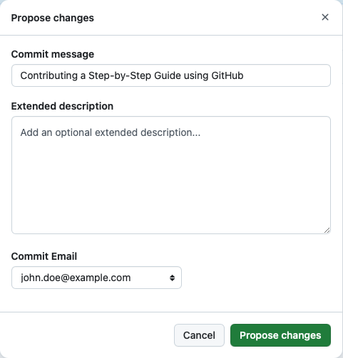

2. Fill in the fields in the dialog:
   * **Commit message:** Briefly describe what you've done. Use just a few words or the title of your Step-by-Step guide.
   * **Extended description:** Optional. You can add a longer description here.
   * **Commit Email:** You can usually leave this unchanged. This is the email address that will be related to your commit.
3. Click the green "Propose changes" button. This will open a new page titled "Comparing changes," looking something like the screenshot below:

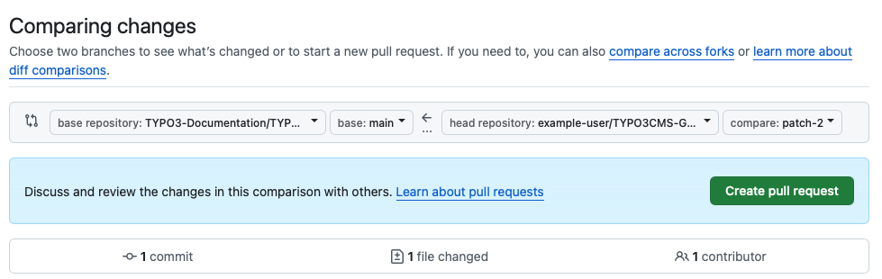

## Open a pull request

When you're finished writing your guide, you're ready to ask for it to be copied from your fork into the official step-by-step guide repository. 

To tell the Step-by-Step Guide maintainers that you have new things to contribute, you must open a *pull request*. Basically a request to "please, pull in my changes."

You're still on the "Comparing changes" page shown in the screenshot above.

1. Click the green "Create pull request" button. The "Create pull request" form will appear, as shown in the screenshot below.

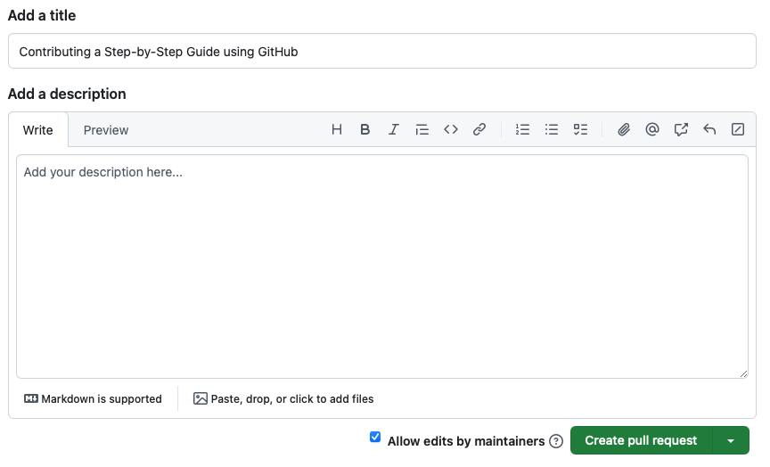

2. In the "Add a title" field, check that the title is how you'd like it to be. It should be the same as you entered in your commit message earlier.
3. Click the green "Create pull request" button.

Your pull request has now been created and the maintainers will be alerted. They will review your Step-by-Step guide and let you know if they have any questions.

## Summary

Thank you for contributing to TYPO3! You have now written and contributed your very own Step-by-Step Guide using only your browser and the tools available at GitHub.

## Next steps

Now that you have written your guide, you can continue by creating more Step-by-Step Guides or make changes to the one you have already created. It is also possible to add screenshot files to your guide to make it more visual.

## Resources

* [Markdown Cheat Sheet](https://docs.typo3.org/permalink/h2document:md-cheat-sheet)
* [Step-by-Step Guide Contributor Guide](Index.md)
* [Using the Step-by-Step Guide Template](30UsingTheTemplate.md)
